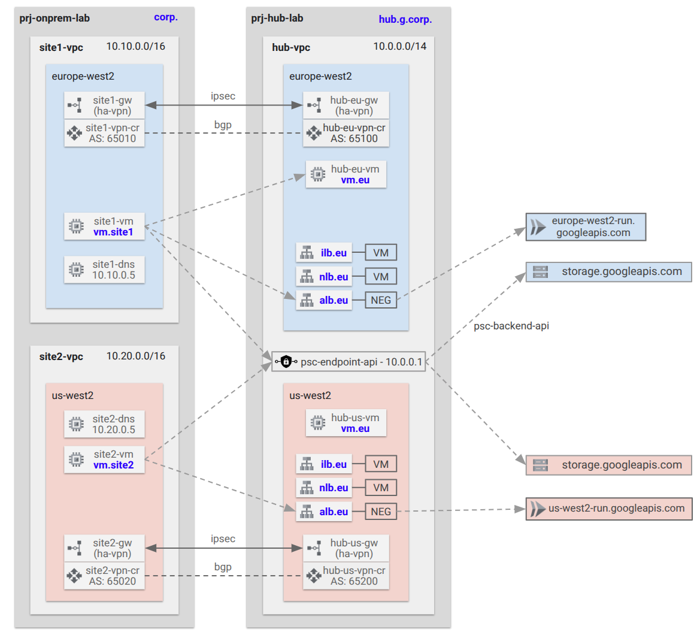

# LAB A: Hybrid with HA-VPN to On-premises <!-- omit from toc -->

Contents
- [Overview](#overview)
- [Prerequisites](#prerequisites)
- [Deploy the Lab](#deploy-the-lab)
- [Troubleshooting](#troubleshooting)
- [Outputs](#outputs)
- [Running Tests from VM Instances](#running-tests-from-vm-instances)
- [Site1 (On-premises EU)](#site1-on-premises-eu)
- [Site2 (On-premises US)](#site2-on-premises-us)
- [Cleanup](#cleanup)
- [Requirements](#requirements)
- [Inputs](#inputs)
- [Outputs](#outputs-1)

## Overview

In this lab:

* A hub VPC network with simple hybrid connectivity to two on-premises sites.
* All north-south and east-west traffic are allowed via VPC firewall rules.
* Hybrid connectivity to simulated on-premises sites is achieved using HA VPN.
* Network Connectivity Center (NCC) is used to connect the on-premises sites together via the external Hub VPC.
* Networking features such as Cloud DNS, PSC for Google APIs and load balancers are also deployed in this lab.



## Prerequisites

Ensure you meet all requirements in the [prerequisites](../../prerequisites/README.md) before proceeding.


## Deploy the Lab

1. Clone the Git Repository for the Labs

    ```sh
    git clone https://github.com/kaysalawu/gcp-network-terraform.git
    ```

2. Navigate to the lab directory

   ```sh
   cd gcp-network-terraform/3-labs/a-hybrid
   ```

3. (Optional) If you want to enable additional features such as IPv6, VPC flow logs and logging set the following variables to `true` in the [`01-main.tf`](./01-main.tf) file.

    | Variable    | Description                 | Default | Link             |
    | ----------- | -------------------------------------- | ------- | --------------------------- |
    | enable_ipv6 | Enable IPv6 on all supported resources | false   | [main.tf](./01-main.tf#L19) |
    |  |                             |         |

4. Run the following terraform commands and type ***yes*** at the prompt:

    ```sh
    terraform init
    terraform plan
    terraform apply -auto-approve
    ```

5. (Optional) Deploy a firewall endpoint in the hub VPC in zone europe-west2-b to match `region1` set in the config file - [00-config](./00-config.tf#L25).

   <Details>
   <Summary>🟢 Click to view the steps</Summary>

   ```sh
   export prefix=a
   export zone=europe-west2-b

   gcloud network-security firewall-endpoints create "$prefix-fwe-$zone" \
   --zone=$zone \
   --organization=$TF_VAR_organization_id \
   --billing-project=$TF_VAR_project_id_hub

   gcloud network-security firewall-endpoints list --zone=$zone --organization=$TF_VAR_organization_id
   ```

   Sample output:

   ```sh
   a-standard$ gcloud network-security firewall-endpoints list --zone=$zone --organization=$TF_VAR_organization_id
   ID                    LOCATION        STATE
   a-fwe-europe-west2-b  europe-west2-b  CREATING
   ```

   Wait until the firewall endpoint is created and the state changes to `ACTIVE` before proceeding to the next step.

   </Details>
   <p>

6. (Optional) When firewall endpoint is active, associate the endpoint with the hub VPC network.

   <Details>
   <Summary>🟢 Click to view the steps</Summary>

   ```sh
   export prefix=a
   export zone=europe-west2-b
   gcloud network-security firewall-endpoint-associations create $prefix-fwe-association \
   --project=$TF_VAR_project_id_hub \
   --zone $zone \
   --network=projects/$TF_VAR_project_id_hub/global/networks/$prefix-hub-vpc \
   --endpoint="$prefix-fwe-$zone" \
   --organization=$TF_VAR_organization_id

   gcloud network-security firewall-endpoint-associations list --project $TF_VAR_project_id_hub --zone=$zone
   ```

   Sample output:

   ```sh
   examples$ gcloud network-security firewall-endpoint-associations list --project $TF_VAR_project_id_hub --zone=$zone
   ID                 LOCATION        NETWORK    ENDPOINT              STATE
   a-fwe-association  europe-west2-b  a-hub-vpc  a-fwe-europe-west2-b  CREATING
   ```

   Wait a few minutes for the state to change from `CREATING` to `ACTIVE`.

   </Details>
   <p>

## Troubleshooting

See the [troubleshooting](../../troubleshooting/README.md) section for tips on how to resolve common issues that may occur during the deployment of the lab.

## Outputs

The table below shows the auto-generated output files from the lab. They are located in the `_output` directory.

| Item   | Description                | Location                                    |
| ----------------- | ------------------------------------- | ------------------------------------------------------ |
| Hub Unbound DNS   | Unbound DNS configuration  | [_output/hub-unbound.sh](./_output/hub-unbound.sh)     |
| Site1 Unbound DNS | Unbound DNS configuration  | [_output/site1-unbound.sh](./_output/site1-unbound.sh) |
| Site2 Unbound DNS | Unbound DNS configuration  | [_output/site2-unbound.sh](./_output/site2-unbound.sh) |
| Web server        | Python Flask web server, test scripts | [_output/vm-startup.sh](./_output/startup.sh)       |
|        |                            |                                             |

## Running Tests from VM Instances

Each virtual machine (VM) is pre-configured with a shell [script](../../scripts/server.sh) to run various types of network reachability tests. Serial console access has been configured for all virtual machines. In each VM instance, Pre-configured test scripts are located in directory `/usr/local/bin/playz`. The scripts run various reachability tests.

- **[test-scripts](./_output/startup.sh)** - Test access to selected Google Cloud Storage buckets
- **[discoverz.py](../../scripts/startup/discoverz.py)** - HTTP test to all google API endpoints

## Site1 (On-premises EU)

1. Login to the instance `b-site1-vm` using the [SSH-in-Browser](https://cloud.google.com/compute/docs/ssh-in-browser) from the Google Cloud console.


2. Run IP ping test

   ```sh
   ping-ipv4
   ```

   <Details>
   <Summary>🟢 Sample output (expand to view)</Summary>

   ```sh
   admin_cloudtuple_com@a-site1-vm:~$ ping-ipv4

    ping ipv4 ...

   site1-vm      - 10.10.1.9 -OK 0.043 ms
   hub-eu-vm     - 10.1.11.9 -OK 3.141 ms
   hub-eu-ilb    - 10.1.11.70 -NA
   site2-vm      - 10.20.1.9 -OK 138.340 ms
   hub-us-vm     - 10.1.21.9 -OK 137.950 ms
   hub-us-ilb    - 10.1.21.70 -NA
   ```
   </Details>
   <p>

   The internal passthrough load balancers - `hub-eu-ilb` and `hub-us-ilb` - are not pingable because their forwarding rules are configured for TCP traffic only and do not respond to ICMP. The forwarding rule need to be configured for `L3_DEFAULT` to allow ICMP traffic.


3. Ping DNS for IPv4 addresses

   ```sh
   ping-dns4
   ```

   <Details>
   <Summary>🟢 Sample output (expand to view)</Summary>

   ```sh
   admin_cloudtuple_com@a-site1-vm:~$ ping-dns4

    ping dns ipv4 ...

   vm.site1.corp - 10.10.1.9 -OK 0.033 ms
   vm.eu.hub.g.corp - 10.1.11.9 -OK 3.178 ms
   ilb.eu.hub.g.corp - 10.1.11.70 -NA
   vm.site2.corp - 10.20.1.9 -OK 138.421 ms
   vm.us.hub.g.corp - 10.1.21.9 -OK 137.733 ms
   ilb.us.hub.g.corp - 10.1.21.70 -NA
   ```
   </Details>
   <p>

   This confirms our onpremises and hybrid-cloud DNS works. We have the same ping results as the IPv4 ping test.


4. Ping DNS for IPv6 addresses

   ```sh
   ping-dns6
   ```

   <Details>
   <Summary>🟢 Sample output (expand to view)</Summary>

   ```sh
   admin_cloudtuple_com@a-site1-vm:~$ ping-dns6
    ping dns ipv6 ...
   vm.site1.corp - fd20:c26:beb5:4000:: -OK 0.039 ms
   vm.eu.hub.g.corp - fd20:ff2:421b:4001:0:1:: -OK 1.639 ms
   ilb.eu.hub.g.corp - fd20:ff2:421b:4001:0:4:: -NA
   vm.site2.corp - fd20:5a3:654b:8000:: -NA
   vm.us.hub.g.corp - fd20:ff2:421b:8000:0:1:: -OK 138.509 ms
   ilb.us.hub.g.corp - fd20:ff2:421b:8000:0:4:: -NA
   ```
   </Details>
   <p>

   We have the same results as the IPv4 tests woth only one exception - the IPv6 address for `vm.site2.corp` is not reachable because Network Connectivity Center (NCC) does not yet support IPv6.


5. Curl IPv4 DNS

   ```sh
   curl-dns4
   ```

   <Details>
   <Summary>🟢 Sample output (expand to view)</Summary>

   ```sh
   admin_cloudtuple_com@a-site1-vm:~$ curl-dns4

    curl dns ipv4 ...

   200 (0.007163s) - 10.10.1.9 - vm.site1.corp
   200 (0.010171s) - 10.1.11.9 - vm.eu.hub.g.corp
   200 (0.007856s) - 10.1.11.70 - ilb.eu.hub.g.corp
   200 (0.028382s) - 10.1.11.80 - nlb.eu.hub.g.corp
   200 (0.019979s) - 10.1.11.90 - alb.eu.hub.g.corp
   200 (0.286873s) - 10.20.1.9 - vm.site2.corp
   200 (0.277139s) - 10.1.21.9 - vm.us.hub.g.corp
   200 (0.276939s) - 10.1.21.70 - ilb.us.hub.g.corp
    - nlb.us.hub.g.corp
    - alb.us.hub.g.corp
   200 (0.027902s) - 10.1.11.70 - ilb.geo.hub.g.corp
   200 (0.057410s) - 104.16.184.241 - icanhazip.com
   204 (0.018704s) - 172.217.169.10 - www.googleapis.com
   204 (0.012137s) - 10.1.0.1 - storage.googleapis.com
   204 (0.045604s) - 10.1.11.90 - europe-west2-run.googleapis.com
    - us-west2-run.googleapis.com
   403 (0.277557s) - 10.1.0.1 - https://a-hub-eu-run-httpbin-wapotrwjpq-nw.a.run.app
   ```

   </Details>
   <p>

   The unreachable services are regional `us` services that cannot be accessed from the on-premises site with HA-VPN in `eu` region.


6. Curl IPv6 DNS

   ```sh
   curl-dns6
   ```

   <Details>
   <Summary>🟢 Sample output (expand to view)</Summary>

   ```sh
   admin_cloudtuple_com@a-site1-vm:~$ curl-dns6

    curl dns ipv6 ...

   200 (0.008121s) - fd20:c26:beb5:4000:: - vm.site1.corp
   200 (0.007832s) - fd20:ff2:421b:4001:0:1:: - vm.eu.hub.g.corp
   200 (0.007668s) - fd20:ff2:421b:4001:0:4:: - ilb.eu.hub.g.corp
   000 (0.003450s) -  - nlb.eu.hub.g.corp
   000 (0.003467s) -  - alb.eu.hub.g.corp
   000 (1.500854s) -  - vm.site2.corp
   200 (0.278524s) - fd20:ff2:421b:8000:0:1:: - vm.us.hub.g.corp
   200 (0.278729s) - fd20:ff2:421b:8000:0:4:: - ilb.us.hub.g.corp
   000 (0.003494s) -  - nlb.us.hub.g.corp
   000 (0.003447s) -  - alb.us.hub.g.corp
   000 (0.003516s) -  - ilb.geo.hub.g.corp
   000 (2.252129s) -  - icanhazip.com
   404 (0.103209s) - 2a00:1450:4009:826::200a - www.googleapis.com
   000 (0.002323s) -  - storage.googleapis.com
   000 (0.003426s) -  - europe-west2-run.googleapis.com
   000 (0.003473s) -  - us-west2-run.googleapis.com
   000 (0.002342s) -  - https://a-hub-eu-run-httpbin-wapotrwjpq-nw.a.run.app
   ```

   </Details>
   <p>

   The unreachable services are regional `us` services that cannot be accessed from the on-premises site through the HA-VPN in `eu` region.  Internal network proxy load balancer (nlb) and internal application load balancer (alb) don't support IPv6 yet.


7. Run an authenticated test to services using the [PSC backend for API access](https://cloud.google.com/vpc/docs/private-service-connect-backends).

   ```sh
   curl-psc-backend
   ```

   <Details>
   <Summary>🟢 Sample output (expand to view)</Summary>

   ```sh
   admin_cloudtuple_com@a-site1-vm:~$ curl-psc-backend

    curl psc backend ...

   204 (0.049128s) - 10.1.11.90 - europe-west2-run.googleapis.com
    - us-west2-run.googleapis.com
   200 (0.877506s) - 10.1.0.1 - https://a-hub-eu-run-httpbin-wapotrwjpq-nw.a.run.app
   ```
   </Details>
   <p>

   We can reach the `eu` cloud run services `europe-west2-run.googleapis.com` through the PSC backend for API access. The VM in `site1` connects to the internal application load balancer in the hub `eu` region. The load balancer uses a Network Endpoint Group (NEG) backend to route traffic to the Cloud Run service. The endpoint in `us` region is not reachable because the on-premises site is connected to the `eu` region. We also have access to the cloud run data plane through the PSC endpoint for API access on private IP address **10.1.0.1**.


8. Test access to all Google APIs using the [discoverz.py](../../scripts/startup/discoverz.py) script.

   ```sh
   cd /var/lib/gcp/fastapi/app/app && \
   python3 discoverz.py
   ```

   <Details>
   <Summary>🟢 Sample output (expand to view)</Summary>

   ```sh
   scanning all api endpoints ...

   204 - abusiveexperiencereport    v1         https://abusiveexperiencereport.googleapis.com/generate_204
   204 - acceleratedmobilepageurl   v1         https://acceleratedmobilepageurl.googleapis.com/generate_204
   204 - accessapproval             v1         https://accessapproval.googleapis.com/generate_204
   204 - accesscontextmanager       v1         https://accesscontextmanager.googleapis.com/generate_204
   204 - addressvalidation          v1         https://addressvalidation.googleapis.com/generate_204
   204 - adexchangebuyer2           v2beta1    https://adexchangebuyer2.googleapis.com/generate_204
   204 - adexperiencereport         v1         https://adexperiencereport.googleapis.com/generate_204
   204 - admin                      datatransfer_v1 https://admin.googleapis.com/generate_204
   204 - admin                      directory_v1 https://admin.googleapis.com/generate_204
   204 - admin                      reports_v1 https://admin.googleapis.com/generate_204
   ...
   [truncated]
   ...
   204 - workloadmanager            v1         https://workloadmanager.googleapis.com/generate_204
   204 - workspaceevents            v1         https://workspaceevents.googleapis.com/generate_204
   204 - workstations               v1         https://workstations.googleapis.com/generate_204
   204 - workstations               v1         https://workstations.googleapis.com/generate_204
   204 - youtube                    v1         https://youtube.googleapis.com/generate_204
   204 - youtubeAnalytics           v1         https://youtubeAnalytics.googleapis.com/generate_204
   204 - youtubereporting           v1         https://youtubereporting.googleapis.com/generate_204

   unreachable api endpoints ...

   err - cloudbilling               v1         https://cloudbilling.googleapis.com/generate_204
   err - cloudbilling               v1         https://cloudbilling.googleapis.com/generate_204
   err - fcmdata                    v1         https://fcmdata.googleapis.com/generate_204
   ```

   </Details>
   <p>


## Site2 (On-premises US)

1. Login to the instance `b-site2-vm` using the [SSH-in-Browser](https://cloud.google.com/compute/docs/ssh-in-browser) from the Google Cloud console.


2. Run IP ping test

   ```sh
   ping-ipv4
   ```

   <Details>
   <Summary>🟢 Sample output (expand to view)</Summary>

   ```sh
   admin_cloudtuple_com@a-site2-vm:~$ ping-ipv4

    ping ipv4 ...

   site1-vm      - 10.10.1.9 -OK 138.686 ms
   hub-eu-vm     - 10.1.11.9 -OK 138.094 ms
   hub-eu-ilb    - 10.1.11.70 -NA
   site2-vm      - 10.20.1.9 -OK 0.056 ms
   hub-us-vm     - 10.1.21.9 -OK 2.807 ms
   hub-us-ilb    - 10.1.21.70 -NA
   ```
   </Details>
   <p>

   The internal passthrough load balancers - `hub-eu-ilb` and `hub-us-ilb` - are not pingable because their forwarding rules are configured for TCP traffic only and do not respond to ICMP. The forwarding rule need to be configured for `L3_DEFAULT` to allow ICMP traffic.


3. Ping DNS for IPv4 addresses

   ```sh
   ping-dns4
   ```

   <Details>
   <Summary>🟢 Sample output (expand to view)</Summary>

   ```sh
   admin_cloudtuple_com@a-site2-vm:~$  ping-dns4

    ping dns ipv4 ...

   vm.site1.corp - 10.10.1.9 -OK 138.210 ms
   vm.eu.hub.g.corp - 10.1.11.9 -OK 137.924 ms
   ilb.eu.hub.g.corp - 10.1.11.70 -NA
   vm.site2.corp - 10.20.1.9 -OK 0.051 ms
   vm.us.hub.g.corp - 10.1.21.9 -OK 2.082 ms
   ilb.us.hub.g.corp - 10.1.21.70 -NA
   ```
   </Details>
   <p>

   This confirms our onpremises and hybrid-cloud DNS works. We have the same ping results as the IPv4 ping test.

4. Ping DNS for IPv6 addresses

   ```sh
   ping-dns6
   ```

   <Details>
   <Summary>🟢 Sample output (expand to view)</Summary>

   ```sh
   admin_cloudtuple_com@a-site2-vm:~$ ping-dns6
    ping dns ipv6 ...
   vm.site1.corp - fd20:c26:beb5:4000:: -NA
   vm.eu.hub.g.corp - fd20:ff2:421b:4001:0:1:: -OK 137.471 ms
   ilb.eu.hub.g.corp - fd20:ff2:421b:4001:0:4:: -NA
   vm.site2.corp - fd20:5a3:654b:8000:: -OK 0.049 ms
   vm.us.hub.g.corp - fd20:ff2:421b:8000:0:1:: -OK 2.381 ms
   ilb.us.hub.g.corp - fd20:ff2:421b:8000:0:4:: -NA
   ```
   </Details>
   <p>

   We have the same results as the IPv4 tests woth only one exception - the IPv6 address for `vm.site2.corp` is not reachable because Network Connectivity Center (NCC) does not yet support IPv6.

5. Curl IPv4 DNS

   ```sh
   curl-dns4
   ```

   <Details>
   <Summary>🟢 Sample output (expand to view)</Summary>

   ```sh
   admin_cloudtuple_com@a-site2-vm:~$ curl-dns4

    curl dns ipv4 ...

   200 (0.282197s) - 10.10.1.9 - vm.site1.corp
   200 (0.278729s) - 10.1.11.9 - vm.eu.hub.g.corp
   200 (0.279401s) - 10.1.11.70 - ilb.eu.hub.g.corp
    - nlb.eu.hub.g.corp
    - alb.eu.hub.g.corp
   200 (0.004576s) - 10.20.1.9 - vm.site2.corp
   200 (0.007781s) - 10.1.21.9 - vm.us.hub.g.corp
   200 (0.007433s) - 10.1.21.70 - ilb.us.hub.g.corp
   200 (0.030998s) - 10.1.21.90 - nlb.us.hub.g.corp
   200 (0.027027s) - 10.1.21.80 - alb.us.hub.g.corp
   200 (0.022949s) - 10.1.21.70 - ilb.geo.hub.g.corp
   200 (0.049007s) - 104.16.184.241 - icanhazip.com
   204 (0.017943s) - 142.250.189.10 - www.googleapis.com
   204 (0.015810s) - 10.1.0.1 - storage.googleapis.com
    - europe-west2-run.googleapis.com
   204 (0.043250s) - 10.1.21.80 - us-west2-run.googleapis.com
   403 (1.077727s) - 10.1.0.1 - https://a-hub-eu-run-httpbin-wapotrwjpq-nw.a.run.app
   ```

   </Details>
   <p>

   The unreachable services are regional `eu` services that cannot be accessed from the on-premises site with HA-VPN in `us` region. The internal passthrough load balancer `ilb.eu.hub.g.corp` is reachable in `eu` region from `us` region because we enabled global access for the frontend.

6. Curl IPv6 DNS

   ```sh
   curl-dns6
   ```

   <Details>
   <Summary>🟢 Sample output (expand to view)</Summary>

   ```sh
   admin_cloudtuple_com@a-site2-vm:~$ curl-dns6

    curl dns ipv6 ...

   000 (1.500561s) -  - vm.site1.corp
   200 (0.278511s) - fd20:ff2:421b:4001:0:1:: - vm.eu.hub.g.corp
   200 (0.276859s) - fd20:ff2:421b:4001:0:4:: - ilb.eu.hub.g.corp
   000 (0.007891s) -  - nlb.eu.hub.g.corp
   000 (0.006886s) -  - alb.eu.hub.g.corp
   200 (0.029059s) - fd20:5a3:654b:8000:: - vm.site2.corp
   200 (0.006776s) - fd20:ff2:421b:8000:0:1:: - vm.us.hub.g.corp
   200 (0.007642s) - fd20:ff2:421b:8000:0:4:: - ilb.us.hub.g.corp
   000 (0.004582s) -  - nlb.us.hub.g.corp
   000 (0.004649s) -  - alb.us.hub.g.corp
   000 (0.004538s) -  - ilb.geo.hub.g.corp
   000 (2.251325s) -  - icanhazip.com
   404 (0.103538s) - 2607:f8b0:4007:80f::200a - www.googleapis.com
   000 (0.003537s) -  - storage.googleapis.com
   000 (0.004547s) -  - europe-west2-run.googleapis.com
   000 (0.004575s) -  - us-west2-run.googleapis.com
   000 (0.004477s) -  - https://a-hub-eu-run-httpbin-wapotrwjpq-nw.a.run.app
   ```

   </Details>
   <p>

   We have the same results as IPv4 curl with the exception of internal network proxy load balancer (nlb) and internal application load balancer (alb) that don't support IPv6 yet.


7. Run an authenticated test to services using the [PSC backend for API access](https://cloud.google.com/vpc/docs/private-service-connect-backends).

   ```sh
   curl-psc-backend
   ```

   <Details>
   <Summary>🟢 Sample output (expand to view)</Summary>

   ```sh
   admin_cloudtuple_com@a-site2-vm:~$  curl-psc-backend

    curl psc backend ...

    - europe-west2-run.googleapis.com
   204 (0.025540s) - 10.1.21.80 - us-west2-run.googleapis.com
   200 (1.159016s) - 10.1.0.1 - https://a-hub-eu-run-httpbin-wapotrwjpq-nw.a.run.app
   ```
   </Details>
   <p>

   We can reach the `us` cloud run services `us-west2-run.googleapis.com` through the PSC backend for API access. The VM in `site2` connects to the internal application load balancer in the hub `us` region. The load balancer uses a Network Endpoint Group (NEG) backend to route traffic to the Cloud Run service.

   The endpoint in `eu` region is not reachable because the on-premises site is connected to the `us` region. We also have access to the cloud run data plane through the PSC endpoint for API access on private IP address **10.1.0.1**.


8. Test access to all Google APIs using the [discoverz.py](../../scripts/startup/discoverz.py) script.

   ```sh
   cd /var/lib/gcp/fastapi/app/app && \
   python3 discoverz.py
   ```

   <Details>
   <Summary>🟢 Sample output (expand to view)</Summary>

   ```sh
   scanning all api endpoints ...

   204 - abusiveexperiencereport    v1         https://abusiveexperiencereport.googleapis.com/generate_204
   204 - acceleratedmobilepageurl   v1         https://acceleratedmobilepageurl.googleapis.com/generate_204
   204 - accessapproval             v1         https://accessapproval.googleapis.com/generate_204
   204 - accesscontextmanager       v1         https://accesscontextmanager.googleapis.com/generate_204
   204 - addressvalidation          v1         https://addressvalidation.googleapis.com/generate_204
   204 - adexchangebuyer2           v2beta1    https://adexchangebuyer2.googleapis.com/generate_204
   204 - adexperiencereport         v1         https://adexperiencereport.googleapis.com/generate_204
   204 - admin                      datatransfer_v1 https://admin.googleapis.com/generate_204
   204 - admin                      directory_v1 https://admin.googleapis.com/generate_204
   204 - admin                      reports_v1 https://admin.googleapis.com/generate_204
   ...
   [truncated]
   ...
   204 - workloadmanager            v1         https://workloadmanager.googleapis.com/generate_204
   204 - workspaceevents            v1         https://workspaceevents.googleapis.com/generate_204
   204 - workstations               v1         https://workstations.googleapis.com/generate_204
   204 - workstations               v1         https://workstations.googleapis.com/generate_204
   204 - youtube                    v1         https://youtube.googleapis.com/generate_204
   204 - youtubeAnalytics           v1         https://youtubeAnalytics.googleapis.com/generate_204
   204 - youtubereporting           v1         https://youtubereporting.googleapis.com/generate_204

   unreachable api endpoints ...

   err - cloudbilling               v1         https://cloudbilling.googleapis.com/generate_204
   err - cloudbilling               v1         https://cloudbilling.googleapis.com/generate_204
   err - fcmdata                    v1         https://fcmdata.googleapis.com/generate_204
   ```

   </Details>
   <p>

## Cleanup

Let's clean up the resources deployed.

1. (Optional) Navigate back to the lab directory (if you are not already there).

   ```sh
   cd gcp-network-terraform/3-labs/a-hybrid
   ```

2. Run terraform destroy.

   ```sh
   terraform destroy -auto-approve
   ```

<!-- BEGIN_TF_DOCS -->
## Requirements

No requirements.

## Inputs

| Name | Description | Type | Default | Required |
|------|-------------|------|---------|:--------:|
| <a name="input_folder_id"></a> [folder\_id](#input\_folder\_id) | folder id | `any` | `null` | no |
| <a name="input_organization_id"></a> [organization\_id](#input\_organization\_id) | organization id | `any` | `null` | no |
| <a name="input_prefix"></a> [prefix](#input\_prefix) | prefix used for all resources | `string` | `"b"` | no |
| <a name="input_project_id_host"></a> [project\_id\_host](#input\_project\_id\_host) | host project id | `any` | n/a | yes |
| <a name="input_project_id_hub"></a> [project\_id\_hub](#input\_project\_id\_hub) | hub project id | `any` | n/a | yes |
| <a name="input_project_id_onprem"></a> [project\_id\_onprem](#input\_project\_id\_onprem) | onprem project id (for onprem site1 and site2) | `any` | n/a | yes |

## Outputs

No outputs.
<!-- END_TF_DOCS -->
