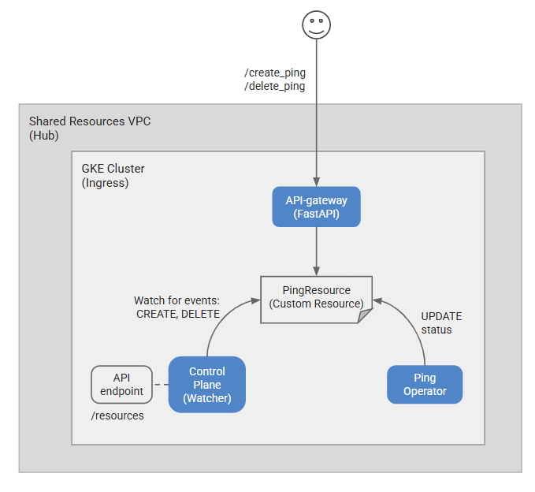
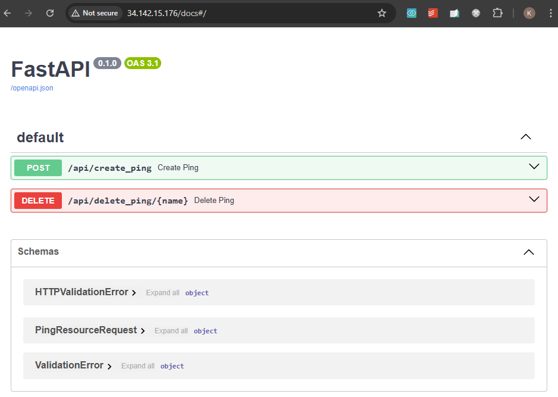
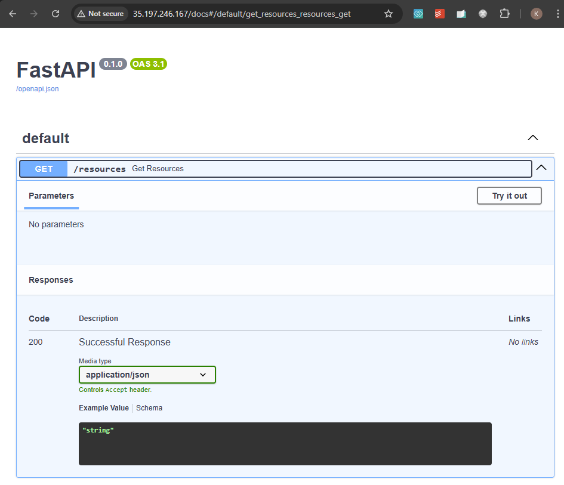

# Simple Kubernetes Customer Resource and Operator <!-- omit from toc -->

Contents
- [1. Overview](#1-overview)
- [2. Prerequisites](#2-prerequisites)
- [3. Deploy the Lab](#3-deploy-the-lab)
- [4. Troubleshooting](#4-troubleshooting)
- [5. Initial Setup](#5-initial-setup)
- [Testing the Operator (GKE)](#testing-the-operator-gke)
- [Cleanup](#cleanup)
- [(Optional) Useful Commands](#optional-useful-commands)
- [Requirements](#requirements)
- [Inputs](#inputs)
- [Outputs](#outputs)


## 1. Overview

This lab deploys a GKE cluster and a simple Kubernetes Operator that watches for a custom resource and prints a message to the logs when the custom resource is created.



## 2. Prerequisites

1. Ensure you meet all requirements in the [prerequisites](../../prerequisites/README.md) before proceeding.
2. [Install skaffold](https://skaffold.dev/docs/install/) for deploying the operator to the GKE cluster.

## 3. Deploy the Lab

3. Clone the Git Repository for the Labs

    ```sh
    git clone https://github.com/kaysalawu/gcp-network-terraform.git
    ```

4. Navigate to the lab directory

   ```sh
   cd gcp-network-terraform/4-general/g1-gke-custom-resource
   ```

5. Deploy the terraform configuration:

    ```sh
    terraform init
    terraform plan
    terraform apply -auto-approve
    ```

## 4. Troubleshooting

See the [troubleshooting](../../troubleshooting/README.md) section for tips on how to resolve common issues that may occur during the deployment of the lab.


## 5. Initial Setup

1. Set some environment variables

   ```sh
   export TF_VAR_project_id_hub=<PLACEHOLDER_FOR_TF_VAR_project_id_hub>
   export LOCATION=europe-west2
   export CLUSTER_NAME=g1-hub-eu-cluster
   ```

2. Get the GKE cluster credentials

   ```sh
   gcloud container clusters get-credentials $CLUSTER_NAME --region="$LOCATION-b" --project=$TF_VAR_project_id_hub
   ```

3. Replace all occurences of project IDs in the manifests with the environment variables.

   ```sh
   for i in $(find artifacts -name '*.yaml'); do sed -i'' -e "s/YOUR_PROJECT_ID/${TF_VAR_project_id_hub}/g" "$i"; done
   ```

## Testing the Operator (GKE)

1. Deploy the operator, control plane and API server using skaffold

   ```sh
   cd artifacts && \
   skaffold run
   ```

2. Confirm the operator is running

   ```sh
   kubectl get pods
   ```

   Sample output

   ```sh
   artifacts$ kubectl get pods
   NAME                            READY   STATUS    RESTARTS   AGE
   api-server-b54f79b98-r4f6c      1/1     Running   0          17s
   control-plane-c6f98d7c-tsc9s    1/1     Running   0          17s
   ping-operator-c89775d94-smxbc   1/1     Running   0          17s
   ```

3. Confirm the CRD is created

   ```sh
   kubectl get crd pingresources.example.com
   ```

   Sample output

   ```sh
   NAME                        CREATED AT
   pingresources.example.com   2025-01-08T08:45:51Z
   ```

4. Confirm the load balancer IP addresses

   ```sh
   kubectl get svc
   ```

   Sample output

   ```sh
   NAME                 TYPE           CLUSTER-IP     EXTERNAL-IP      PORT(S)        AGE
   api-server-elb       LoadBalancer   10.1.102.157   34.105.153.156   80:30435/TCP   50s
   api-server-service   ClusterIP      10.1.102.27    <none>           8080/TCP       51s
   control-plane        ClusterIP      10.1.102.185   <none>           9000/TCP       51s
   control-plane-elb    LoadBalancer   10.1.102.206   <pending>        80:30099/TCP   50s
   kubernetes           ClusterIP      10.1.102.1     <none>           443/TCP        168m
   ```

5. Extract the external IP addresses and create `test-ping1` resource

   ```sh
   API_SERVER_IP=$(kubectl get svc api-server-elb -o jsonpath='{.status.loadBalancer.ingress[0].ip}') && \
   curl -X POST "http://$API_SERVER_IP/api/create_ping" -H "Content-Type: application/json" -d '{"name": "test-ping1", "message": "Hello from FastAPI"}' && echo
   ```

   Sample output

   ```json
   {"status":"success","name":"test-ping1"}
   ```

6. Confirm `test-ping1` custom resource is created

   ```sh
   kubectl get pingresource test-ping1 -o yaml
   ```

   <details>
   <summary>🟢 Sample output</summary>

   ```yaml
   apiVersion: example.com/v1
   kind: PingResource
   metadata:
     annotations:
       kopf.zalando.org/last-handled-configuration: |
         {"spec":{"message":"Hello from FastAPI"}}
     creationTimestamp: "2025-02-07T19:48:45Z"
     finalizers:
     - kopf.zalando.org/KopfFinalizerMarker
     generation: 2
     name: test-ping1
     namespace: default
     resourceVersion: "131792"
     uid: fd728d80-45fc-4600-8b86-c6a589f577a8
   spec:
     message: Hello from FastAPI
   status:
     response: Hello from FastAPI - Pong
   ```

   </details>
   <p  >

7. Confirm the control plane events

   ```sh
   CONTROL_PLANE_IP=$(kubectl get svc control-plane-elb -o jsonpath='{.status.loadBalancer.ingress[0].ip}') && \
   curl -X GET "http://$CONTROL_PLANE_IP/resources" -H "Content-Type: application/json" && echo
   ```

   Sample output

   ```json
   {"resources":{"test-ping1":"created"}}
   ```

8. Create `test-ping2` resource using kubectl and confirm it is created

   ```sh
   kubectl apply -f ping/manifests/kustomize/overlays/ping-resources/pingresource.yaml && \
   kubectl get pingresource test-ping2 -o yaml
   ```

   Sample output

   <details>
   <summary>🟢 Sample output</summary>

   ```yaml
   apiVersion: example.com/v1
   kind: PingResource
   metadata:
     annotations:
       kopf.zalando.org/last-handled-configuration: |
         {"spec":{"message":"Ping"}}
       kubectl.kubernetes.io/last-applied-configuration: |
         {"apiVersion":"example.com/v1","kind":"PingResource","metadata":{"annotations":{},"name":"test-ping2","namespace":"default"},"spec":{"message":"Ping"}}
     creationTimestamp: "2025-02-07T19:54:49Z"
     finalizers:
     - kopf.zalando.org/KopfFinalizerMarker
     generation: 2
     name: test-ping2
     namespace: default
     resourceVersion: "136071"
     uid: 8d327dec-de62-4350-943e-669e9ae492cf
   spec:
     message: Ping
   status:
     response: Ping - Pong
   ```

9. (Optional) Test API server using FastApi web interface

   Go to `http://$API_SERVER_IP/docs` in your browser and test the API server.

   

10. (Optional) Test control plane using FastApi web interface

   Go to `http://$CONTROL_PLANE_IP/docs` in your browser and test the control plane.

   

11. Delete the resources

    ```sh
    kubectl delete pingresource test-ping1 && \
    curl -X DELETE "http://$API_SERVER_IP/api/delete_ping/test-ping2"
    skaffold delete && \
    cd ..
    ```

## Cleanup

1. (Optional) Navigate back to the lab directory (if you are not already there).

   ```sh
   cd gcp-network-terraform/4-general/g1-gke-custom-resource
   ```

2. Run terraform destroy.

   ```sh
   terraform destroy -auto-approve
   ```

## (Optional) Useful Commands

1. Force delete PingResource custom resource

   ```sh
   kubectl patch pingresource test-ping1 -p '{"metadata":{"finalizers":[]}}' --type=merge
   ```

<!-- BEGIN_TF_DOCS -->
## Requirements

No requirements.

## Inputs

| Name | Description | Type | Default | Required |
|------|-------------|------|---------|:--------:|
| <a name="input_folder_id"></a> [folder\_id](#input\_folder\_id) | folder id | `any` | `null` | no |
| <a name="input_organization_id"></a> [organization\_id](#input\_organization\_id) | organization id | `any` | `null` | no |
| <a name="input_prefix"></a> [prefix](#input\_prefix) | prefix used for all resources | `string` | `"g1"` | no |
| <a name="input_project_id_hub"></a> [project\_id\_hub](#input\_project\_id\_hub) | hub project id | `any` | n/a | yes |

## Outputs

No outputs.
<!-- END_TF_DOCS -->
