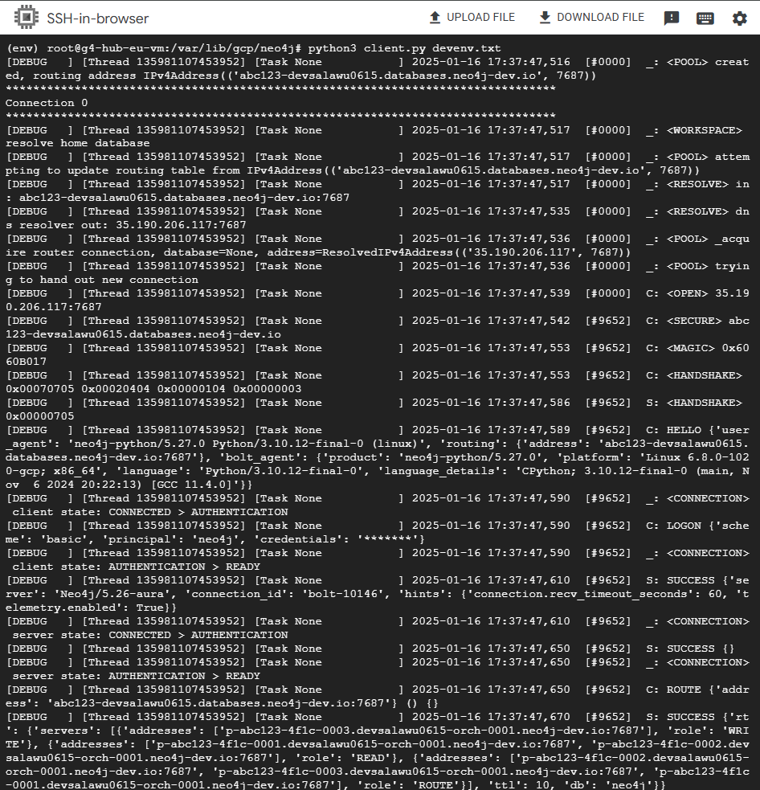

# Lab G3: Neo4j GCP Client and Private Service Connect <!-- omit from toc -->

Contents- [Overview](#overview)
- [Overview](#overview)
- [Prerequisites](#prerequisites)
- [Deploy the Lab](#deploy-the-lab)
- [Initial Configuration](#initial-configuration)
- [Troubleshooting](#troubleshooting)
  - [1. Configuration and Testing](#1-configuration-and-testing)
- [Cleanup](#cleanup)
- [Requirements](#requirements)
- [Inputs](#inputs)
- [Outputs](#outputs)


## Overview

This lab deploys a simple GCP VPC with a VM installed with neo4j client for testing connectivity to Neo4j databases over Private Service Connect.

## Prerequisites

1. Ensure you meet all requirements in the [prerequisites](../../prerequisites/README.md) before proceeding.
2. [Install skaffold](https://skaffold.dev/docs/install/) for deploying the operator to the GKE cluster.

## Deploy the Lab

1\. Clone the Git Repository for the Labs

 ```sh
 git clone https://github.com/kaysalawu/gcp-network-terraform.git
 ```

2\. Navigate to the lab directory

```sh
cd gcp-network-terraform/4-general/g3-neo4j-auradb-psc
```

3\. Run the following terraform commands and type ***yes*** at the prompt:

 ```sh
 terraform init
 terraform plan
 terraform apply -auto-approve
 ```

 ## Initial Configuration

1\. Set the project environment variable:

Example:

```sh
export TF_VAR_project_id_hub=<my-project-id>
```

2\. Set the neo4j environment variables:

Example:

```sh
export TF_VAR_neo4j_db_uri=<neo4j+s://your-db-host.databases.neo4j.io>
export TF_VAR_neo4j_db_username="neo4j"
export TF_VAR_neo4j_db_password="Password123"
```

3\. Run the following terraform commands and type ***yes*** at the prompt:

```sh
terraform init
terraform plan
terraform apply -parallelism=50 -auto-approve
```

## Troubleshooting

See the [troubleshooting](../../troubleshooting/README.md) section for tips on how to resolve common issues that may occur during the deployment of the lab.


### 1. Configuration and Testing

**1.1** Login to the instance `g3-hub-eu-vm` using the [SSH-in-Browser](https://cloud.google.com/compute/docs/ssh-in-browser) from the Google Cloud console.

**1.2** Navigate to the pre-installed neo4j directory.

```sh
cd /var/lib/gcp/neo4j && sudo su
ls -la
```

<details>

<summary>Sample output</summary>

```sh
# ls -la
total 32
drwxr-xr-x 3 root root 4096 Jan 14 16:51 .
drwxr-xr-x 4 root root 4096 Jan 14 16:50 ..
-rwxr--r-- 1 root root  124 Jan 14 16:50 Dockerfile
-rwxr--r-- 1 root root 1378 Jan 14 16:50 client.py
-rwxr--r-- 1 root root  112 Jan 14 16:50 devenv.txt
drwxr-xr-x 5 root root 4096 Jan 14 16:51 env
-rwxr--r-- 1 root root 2588 Jan 14 16:50 query.py
-rwxr--r-- 1 root root   35 Jan 14 16:50 requirements.txt
```

</details>
<p>

**1.3** Activate the python virtual environment **env**.

```sh
source env/bin/activate
```

**1.4** Install the required python packages.

```sh
pip install -r requirements.txt
```

**1.5** Run the `client.py` script to test connection to the database.

```sh
python3 client.py devenv.txt
```

**1.6** Confirm

The client should successfully connect to the Neo4j database.


<p>

**1.7** Confirm that the database query uses [bolt](https://neo4j.com/docs/bolt/current/bolt/) protocol on **TCP** port **7687**.

The databse query runs on tcp port 7687 as shown in the output below:

```sh
tcpdump -nnn -q -i any tcp port 7474 or tcp port 7473 or tcp port 7687
```

Sample output:

```sh
tcpdump: data link type LINUX_SLL2
tcpdump: verbose output suppressed, use -v[v]... for full protocol decode
listening on any, link-type LINUX_SLL2 (Linux cooked v2), snapshot length 262144 bytes
18:59:38.060299 ens4  Out IP 10.1.11.9.60970 > 35.190.206.117.7687: tcp 0
18:59:38.062519 ens4  In  IP 35.190.206.117.7687 > 10.1.11.9.60970: tcp 0
18:59:38.062544 ens4  Out IP 10.1.11.9.60970 > 35.190.206.117.7687: tcp 0
18:59:38.072518 ens4  Out IP 10.1.11.9.60970 > 35.190.206.117.7687: tcp 517
18:59:38.072942 ens4  In  IP 35.190.206.117.7687 > 10.1.11.9.60970: tcp 0
18:59:38.074605 ens4  In  IP 35.190.206.117.7687 > 10.1.11.9.60970: tcp 6486
18:59:38.074625 ens4  Out IP 10.1.11.9.60970 > 35.190.206.117.7687: tcp 0
18:59:38.078005 ens4  Out IP 10.1.11.9.60970 > 35.190.206.117.7687: tcp 80
18:59:38.085615 ens4  Out IP 10.1.11.9.60970 > 35.190.206.117.7687: tcp 42
18:59:38.086067 ens4  In  IP 35.190.206.117.7687 > 10.1.11.9.60970: tcp 0
18:59:38.086846 ens4  In  IP 35.190.206.117.7687 > 10.1.11.9.60970: tcp 508
```

## Cleanup

1\. (Optional) Navigate back to the lab directory (if you are not already there).

```sh
cd gcp-network-terraform/4-general/g3-neo4j-auradb-psc
```

2\. Run terraform destroy.

```sh
terraform destroy -auto-approve
```

<!-- BEGIN_TF_DOCS -->
## Requirements

No requirements.

## Inputs

| Name                                                                              | Description                   | Type     | Default | Required |
| --------------------------------------------------------------------------------- | ----------------------------- | -------- | ------- | :------: |
| <a name="input_folder_id"></a> [folder\_id](#input\_folder\_id)                   | folder id                     | `any`    | `null`  |    no    |
| <a name="input_organization_id"></a> [organization\_id](#input\_organization\_id) | organization id               | `any`    | `null`  |    no    |
| <a name="input_prefix"></a> [prefix](#input\_prefix)                              | prefix used for all resources | `string` | `"g3"`  |    no    |
| <a name="input_project_id_hub"></a> [project\_id\_hub](#input\_project\_id\_hub)  | hub project id                | `any`    | n/a     |   yes    |

## Outputs

No outputs.
<!-- END_TF_DOCS -->
