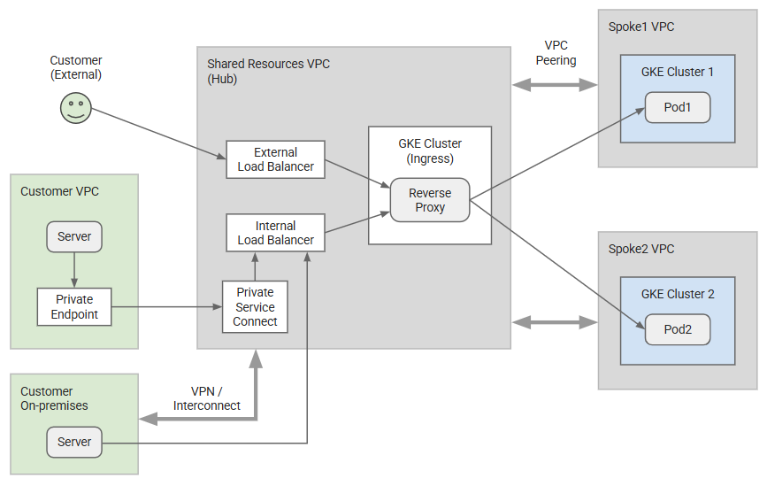
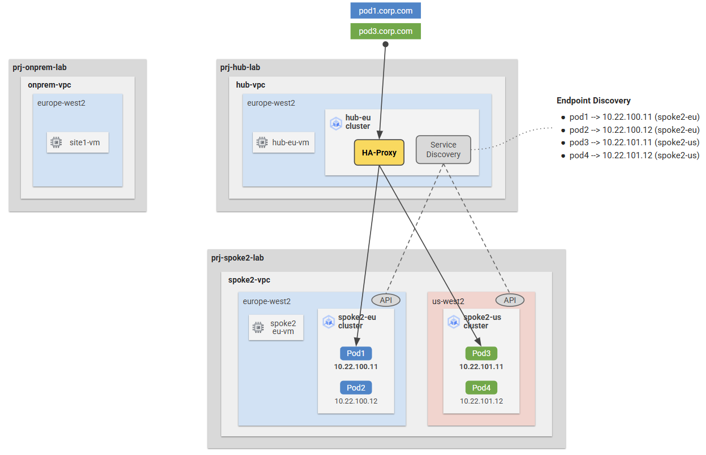
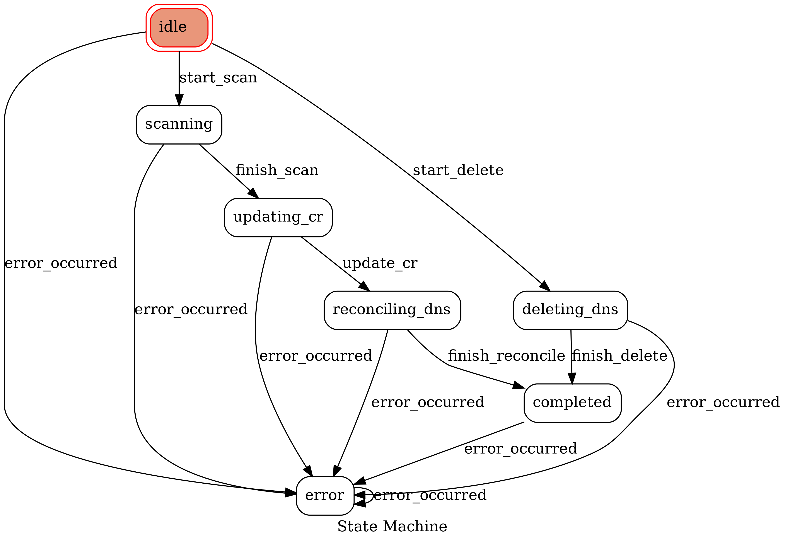
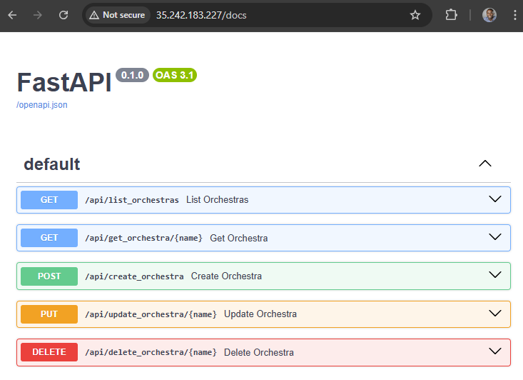

# Centralised Kubernetes Ingress on GCP <!-- omit from toc -->

Contents
- [1. Overview](#1-overview)
  - [Hub and Spoke GKE Ingress](#hub-and-spoke-gke-ingress)
  - [Service Discovery Operator State Machine](#service-discovery-operator-state-machine)
  - [HAProxy](#haproxy)
  - [User Application](#user-application)
- [2. Prerequisites](#2-prerequisites)
- [3. Deploy the Lab](#3-deploy-the-lab)
- [4. Troubleshooting](#4-troubleshooting)
- [5. Deploy the Spoke Cluster](#5-deploy-the-spoke-cluster)
- [6. Deploy the Hub (Ingress) Cluster](#6-deploy-the-hub-ingress-cluster)
- [7. Deploy Custom Resource (CR) in the Hub using API Server](#7-deploy-custom-resource-cr-in-the-hub-using-api-server)
- [8. Delete a Pod in Spoke Cluster](#8-delete-a-pod-in-spoke-cluster)
- [9. Deploy Custom Resource (CR) in the Hub using Manifest](#9-deploy-custom-resource-cr-in-the-hub-using-manifest)
- [10. Create HAProxy in the Hub Cluster](#10-create-haproxy-in-the-hub-cluster)
- [Summary](#summary)
- [Cleanup](#cleanup)
- [Requirements](#requirements)
- [Inputs](#inputs)
- [Outputs](#outputs)


## 1. Overview

Many organisations use a [hub and spoke](https://cloud.google.com/architecture/deploy-hub-spoke-vpc-network-topology) network architecture to connect their cloud infrastructure together. The hub typically hosts shared services which might include network ingress and network egress solutions. The spokes are typically connected to the hub using VPC peering.

The ingress receives internal and external traffic and forwards to the spokes. The ingress layer typically comprises of resources such as network firewalls, network load balancers, application load balancers or a combination of any these. In other cases, customers need a custom ingress solution to handle specific business logic that regular cloud load balancers cannot manage. In such situations, the ingress could be a Google Kubernetes Engine (GKE) cluster that routes traffic to the spoke clusters - that are also GKE clusters. This is what this lab is about.




### Hub and Spoke GKE Ingress

This lab deploys a GKE ingress pattern to allow access from a hub to spoke clusters. The custom hub ingress, a haproxy deployment, performs service discovery via Cloud DNS to route traffic to the spoke cluster that hosts the target pod.

Assumptions made for this design:

1. The hub reverse proxy can reach all pods in the spoke clusters directly.
2. Kubernetes headless services are used and requests are sent directly to pods.
3. The hub cluster has a private DNS zone for the internal domain name resolution.
<p>


<p>

In this lab, the ingress will rote both HTTP and TCP traffic. For HTTP traffic, the ingress forwards to a backend based on the host name header. The ingress uses host names in SNI to route TCP traffic to the target pod.

### Service Discovery Operator State Machine

Service discovery is implemented using a simple Kubernetes custom resource (CR) and operator. The operator watches for the custom resource and updates the Cloud DNS with pod IP addresses when the custom resource is created or deleted. In this example, the CR represents a kubernetes cluster. The CR has a status field that is updated with the cluster's pod IP addresses.



### HAProxy

The HAProxy has a [ConfigMap](artifacts/discovery/haproxy/charts_rendered/1-haproxy/templates/2-config.yaml) that routes traffic in two modes - HTTP and TCP. The HAProxy forwards HTTP(S) traffic to the user applications based on the host name header. We are using [LetsEncrypt certificates](artifacts/discovery/haproxy/charts_rendered/0-system/templates/1-tls-cert.yaml) for the TLS termination. The HAProxy forwards TCP traffic to the user applications based on the SNI host received during TLS handshake.


### User Application

We are simulating user applications that run in the spoke cluster. The application is simply a pod with containers configured as follows:
- HTTP server on port **7474**
- HTTPS server on port **7473**
- TCP server on port **7687**

## 2. Prerequisites

1. Ensure you meet all requirements in the [prerequisites](../../prerequisites/README.md) before proceeding.
2. [Install skaffold](https://skaffold.dev/docs/install/) for deploying the operator to the GKE cluster.
3. Install kubectx to switch between kubernetes contexts. [Install kubectx](https://github.com/ahmetb/kubectx?tab=readme-ov-file#installation)
4. Install [skaffold](https://skaffold.dev/docs/install/#standalone-binary), the tool we'll use for building and deploying to Kubernetes.
5. Create two GCP projects, one for the hub and the other for the spoke clusters.
6. Install `netcat` for testing TCP traffic.
   ```sh
   sudo apt update
   sudo apt install netcat
   ```

## 3. Deploy the Lab

1. Clone the Git Repository for the Labs

    ```sh
    git clone https://github.com/kaysalawu/gcp-network-terraform.git
    ```

2. Navigate to the lab directory

   ```sh
   cd gcp-network-terraform/4-general/g5-gke-ingress
   ```

3. Set the environment variables for the lab
   ```sh
   export TF_VAR_project_id_hub=<PLACEHOLDER_FOR_HUB_PROJECT_ID>
   export TF_VAR_project_id_spoke2=<PLACEHOLDER_FOR_SPOKE_PROJECT_ID>
   export LOCATION=europe-west2
   export HUB_CLUSTER_NAME=g5-hub-eu-cluster
   export SPOKE_CLUSTER_NAME=g5-spoke2-eu-cluster
   export HUB_CONTEXT=gke_${TF_VAR_project_id_hub}_${LOCATION}-b_${HUB_CLUSTER_NAME}
   export SPOKE_CONTEXT=gke_${TF_VAR_project_id_spoke2}_${LOCATION}-b_${SPOKE_CLUSTER_NAME}
   ```

4. Deploy the terraform configuration:

    ```sh
    terraform init
    terraform plan
    terraform apply -auto-approve
    ```

    This creates the VPC network, subnets, GKE clusters and the artifacts and kubernetes service accounts required to deploy the applications to the GKE clusters.

5. Get the GKE cluster credentials for the spoke and hub clusters

   ```sh
   gcloud container clusters get-credentials $SPOKE_CLUSTER_NAME --region "$LOCATION-b" --project=$TF_VAR_project_id_spoke2 && \
   gcloud container clusters get-credentials $HUB_CLUSTER_NAME --region "$LOCATION-b" --project=$TF_VAR_project_id_hub
   ```

6. Replace all occurences of project IDs in the manifests with the environment variables.

   ```sh
   for i in $(find artifacts -name '*.yaml'); do sed -i'' -e "s/YOUR_HUB_PROJECT_ID/${TF_VAR_project_id_hub}/g" "$i"; done && \
   for i in $(find artifacts -name '*.yaml'); do sed -i'' -e "s/YOUR_SPOKE_PROJECT_ID/${TF_VAR_project_id_spoke2}/g" "$i"; done
   ```

7. Install cert-manager in the hub cluster in order to use Let's Encrypt certificates for our custom ingress.

   ```sh
   kubectx ${HUB_CONTEXT} && \
   helm repo add jetstack https://charts.jetstack.io && \
   helm repo update && \
   helm install cert-manager jetstack/cert-manager --namespace cert-manager --create-namespace --version v1.15.1 --set crds.enabled=true || true && \
   kubectl get pods -n cert-manager
   ```

   <Details>

   <summary>🟢 Sample output (cert-manager installed):</summary>

   ```sh
   NAME                                       READY   STATUS    RESTARTS   AGE
   cert-manager-5d45994f57-d798l              1/1     Running   0          17s
   cert-manager-cainjector-5d69455fd6-gmqdc   1/1     Running   0          17s
   cert-manager-webhook-56f4567ccb-7llcg      1/1     Running   0          17s
   ```

   </Details>
   <p>


## 4. Troubleshooting

See the [troubleshooting](../../troubleshooting/README.md) section for tips on how to resolve common issues that may occur during the deployment of the lab.


## 5. Deploy the Spoke Cluster

A skaffold file is located at [artifacts/skaffold.yaml](./artifacts/skaffold.yaml) with different profiles for deploying various components.

1. Navigate to the artifacts directory

   ```sh
   cd artifacts
   ```

2. Deploy the spoke workload using Skaffold and Helm

   ```sh
   kubectx ${SPOKE_CONTEXT} && \
   skaffold run -p workload && \
   kubectl get pods
   ```

   Sample output:

   ```sh
   artifacts$ kubectl get pods
   NAME    READY   STATUS    RESTARTS   AGE
   user1   3/3     Running   0          35s
   user2   3/3     Running   0          35s
   ```

## 6. Deploy the Hub (Ingress) Cluster

Let's create the following components to the hub cluster:
1. [Customer Resource Definition](artifacts/discovery/operator/manifests/kustomize/base/main/orchestra-crd.yaml) (CRD) and [Operator](artifacts/discovery/operator/manifests/kustomize/base/main/discovery-operator.yaml) deployment to manage the `Orchestra` Custom Resource (CR)
2. [API gateway](artifacts/discovery/api-server/manifests/kustomize/base/main/api-server.yaml) (FastAPI) to manage the `Orchestra` CR via REST API
3. HAProxy as our ingress reverse proxy for HTTP and TCP traffic


2. Deploy the CRD and Operator and wait a few minutes to complete

   ```sh
   kubectx ${HUB_CONTEXT} && \
   skaffold run -p operator && \
   kubectl get crd orchestras.example.com
   ```

   Sample output:

   ```sh
   NAME                     CREATED AT
   orchestras.example.com   2025-02-05T10:06:26Z
   ```

   Check the operator logs to verify it is running

   ```sh
   kubectl logs $(kubectl get pods --no-headers -o custom-columns=":metadata.name" | grep operator)
   ```

   <Details>

   <summary>🟢 Sample logs (Operator created):</summary>

   ```sh
   artifacts$  kubectl logs $(kubectl get pods --no-headers -o custom-columns=":metadata.name" | grep operator)
   [2025-02-07 13:44:58,234] __kopf_script_0__/ap [INFO    ] Project ID: prj-hub-lab
   [2025-02-07 13:44:58,744] __kopf_script_0__/ap [INFO    ] Private DNS zone: [{'name': 'g5-hub-private', 'dns_name': 'hub.g.corp.', 'description': 'local data'}]
   [2025-02-07 13:44:58,864] kopf.activities.star [INFO    ] Activity 'start_scanner' succeeded.
   [2025-02-07 13:44:58,866] kopf._core.engines.a [INFO    ] Initial authentication has been initiated.
   [2025-02-07 13:44:58,868] kopf.activities.auth [INFO    ] Activity 'login_via_client' succeeded.
   [2025-02-07 13:44:58,868] kopf._core.engines.a [INFO    ] Initial authentication has finished.
   [2025-02-07 13:44:59,674] __kopf_script_0__/ap [INFO    ] [IDLE] Registered CRs: []
   [2025-02-07 13:45:19,860] __kopf_script_0__/ap [INFO    ] [IDLE] Registered CRs: []
   ```

   </Details>
   <p>

   The operator is running and watching for CRs. Currently, there are no CRs in the cluster.

3. Deploy the API server

   ```sh
   kubectx ${HUB_CONTEXT} && \
   skaffold run -p api-server && \
   kubectl logs $(kubectl get pods --no-headers -o custom-columns=":metadata.name" | grep api-server)
   ```

   <Details>

   <summary>🟢 Sample logs (API server running):</summary>

   ```sh
   artifacts$ kubectl logs $(kubectl get pods --no-headers -o custom-columns=":metadata.name" | grep api-server)
   INFO:     Started server process [1]
   INFO:     Waiting for application startup.
   INFO:     Application startup complete.
   INFO:     Uvicorn running on http://0.0.0.0:8080 (Press CTRL+C to quit)
   ```

   </Details>
   <p>

   The API server (FastAPI) is now running. The API server is also exposed on external load balancer.

   Get the external IP address of the API server

   ```sh
   API_SERVER_IP=$(kubectl get svc api-server-elb -o jsonpath='{.status.loadBalancer.ingress[0].ip}') && echo $API_SERVER_IP
   ```

   You can use the web interface to test the API server. Go to `http://$API_SERVER_IP/docs` in your browser. However, we will use curl to test the API server in the next steps.

   


4. Verify that the operator and api-server pods are running

   ```sh
   kubectl get pods
   ```

   Sample output:

   ```sh
   artifacts$  kubectl get pods
   NAME                                  READY   STATUS    RESTARTS   AGE
   api-server-b9fc54ddb-zgsxb            1/1     Running   0          57s
   discovery-operator-6884ff75fc-426qg   1/1     Running   0          4m36s
   ```

## 7. Deploy Custom Resource (CR) in the Hub using API Server

The customer resource `Orchestra` is a simple CR that represents a kubernetes cluster. The CR has a status field that is updated with the cluster's pod IP addresses.

In a real world scenario, when a new kubernetes cluster is created, an automated process should create the CR for that orchestra - and then the operator will detect the CR and run the state machine logic. To make things simple, we are manually creating the CR using the API server.

**Service Discovery Operator workflow (CR creation):**

1. Fetch the cluster endpoint and auth data
2. Switch the context to the spoke cluster
3. Scan the pods in the spoke cluster
4. Update the CR status with the pod IP addresses
5. Check the existing DNS records for reconciliation
6. Create the DNS records for the pods if they do not exist
7. Update the HAProxy with frontend and backend configurations for the new pods
8. Repeat the above steps every 20 seconds
<p>

Let's create the required resources in the hub cluster.

1. Deploy the CR using the API server

   ```sh
   curl -X 'POST' \
     "http://${API_SERVER_IP}/api/create_orchestra" \
     -H "accept: application/json" \
     -H "Content-Type: application/json" \
     -d '{
     "cluster": "g5-spoke2-eu-cluster",
     "ingress": "ingress01",
     "name": "orch01",
     "project": "'"${TF_VAR_project_id_spoke2}"'",
     "zone": "europe-west2-b"
   }'
   ```

   Check the operator logs to verify the CR was created

   ```sh
   kubectx ${HUB_CONTEXT} && \
   kubectl logs -f $(kubectl get pods --no-headers -o custom-columns=":metadata.name" | grep operator)
   ```

   <Details>

   <summary>🟢 Operator logs (CR created):</summary>

   ```sh
   25-02-07 13:53:45,208] __kopf_script_0__/ap [INFO    ] [IDLE] Registered CRs: []
   [2025-02-07 13:54:05,390] __kopf_script_0__/ap [INFO    ] [IDLE] Registered CRs: []
   [2025-02-07 13:54:08,012] __kopf_script_0__/ap [INFO    ] [orch01] kopf.on.create() +finalizer
   [2025-02-07 13:54:08,012] __kopf_script_0__/ap [INFO    ] [orch01] ***** CREATE *****
   Fetching cluster endpoint and auth data.
   kubeconfig entry generated for g5-spoke2-eu-cluster.
   [2025-02-07 13:54:09,836] _PodManager          [INFO    ] [orch01] scanning -> set_context() -> gke_prj-spoke2-lab_europe-west2-b_g5-spoke2-eu-cluster
   Property "current-context" unset.
   [2025-02-07 13:54:10,177] _PodManager          [INFO    ] [orch01] scanning -> unset_context() (in_cluster_config)
   [2025-02-07 13:54:10,177] __kopf_script_0__/ap [INFO    ] [orch01] scanning -> scan_pods() -> Found [2] pods
   [2025-02-07 13:54:10,177] __kopf_script_0__/ap [INFO    ] [orch01] updating_cr -> update_custom_resource() -> Start
   [2025-02-07 13:54:10,194] __kopf_script_0__/ap [INFO    ] [orch01] updating_cr -> update_custom_resource() -> Success!
   [2025-02-07 13:54:10,495] __kopf_script_0__/ap [INFO    ] [orch01] reconciling_dns -> reconcile_dns() -> Found [0] records
   [2025-02-07 13:54:10,881] utils                [INFO    ] [orch01] reconciling_dns -> create_dns_a_record() -> Added user1-orch01.hub.g.corp. = 10.22.100.11
   [2025-02-07 13:54:11,277] utils                [INFO    ] [orch01] reconciling_dns -> create_dns_a_record() -> Added user2-orch01.hub.g.corp. = 10.22.100.10
   [2025-02-07 13:54:11,278] kopf.objects         [INFO    ] [default/orch01] Handler 'on_orchestra_create' succeeded.
   [2025-02-07 13:54:11,278] kopf.objects         [INFO    ] [default/orch01] Creation is processed: 1 succeeded; 0 failed.
   [2025-02-07 13:54:25,575] __kopf_script_0__/ap [INFO    ] [IDLE] Registered CRs: ['orch01']
   Fetching cluster endpoint and auth data.
   kubeconfig entry generated for g5-spoke2-eu-cluster.
   [2025-02-07 13:54:27,468] _PodManager          [INFO    ] [orch01] scanning -> set_context() -> gke_prj-spoke2-lab_europe-west2-b_g5-spoke2-eu-cluster
   Property "current-context" unset.
   [2025-02-07 13:54:27,755] _PodManager          [INFO    ] [orch01] scanning -> unset_context() (in_cluster_config)
   [2025-02-07 13:54:27,755] __kopf_script_0__/ap [INFO    ] [orch01] scanning -> scan_pods() -> Found [2] pods
   [2025-02-07 13:54:27,756] __kopf_script_0__/ap [INFO    ] [orch01] updating_cr -> update_custom_resource() -> Start
   [2025-02-07 13:54:27,781] __kopf_script_0__/ap [INFO    ] [orch01] updating_cr -> update_custom_resource() -> Success!
   [2025-02-07 13:54:28,013] __kopf_script_0__/ap [INFO    ] [orch01] reconciling_dns -> reconcile_dns() -> Found [2] records
   ```

   </Details>
   <p>

   Press **Ctrl+C** to exit the logs.

2. Verify the CR was created

   ```sh
   kubectx ${HUB_CONTEXT} && \
   kubectl get orchestras
   ```

   Sample output:

   ```sh
   NAME     CLUSTER                INGRESS     ZONE             REGION       PROJECT
   orch01   g5-spoke2-eu-cluster   ingress01   europe-west2-b   <no value>   prj-spoke2-lab
   ```

3. Verify the CR status is updated with the pod IP addresses

   ```sh
   kubectl get orchestras orch01 -o yaml
   ```

   Sample output:

   ```yaml
   apiVersion: example.com/v1
   kind: Orchestra
   metadata:
     annotations:
       kopf.zalando.org/last-handled-configuration: |
         {"spec":{"cluster":"g5-spoke2-eu-cluster","ingress":"ingress01","project":"prj-spoke2-lab","region":null,"zone":"europe-west2-b"}}
     creationTimestamp: "2025-02-07T13:54:07Z"
     finalizers:
     - kopf.zalando.org/KopfFinalizerMarker
     - orchestra.finalizer.example.com
     generation: 2
     name: orch01
     namespace: default
     resourceVersion: "56408"
     uid: 61b91461-bf52-403e-8845-4b74950eadc3
   spec:
     cluster: g5-spoke2-eu-cluster
     ingress: ingress01
     project: prj-spoke2-lab
     region: null
     zone: europe-west2-b
   status:
     endpoints:
     - hostIp: 10.22.12.3
       phase: Running
       podIp: 10.22.100.11
       podName: user1
     - hostIp: 10.22.12.3
       phase: Running
       podIp: 10.22.100.10
       podName: user2
     state: Updated
   ```

   At this point, the operator has updated the CR status and configured Cloud DNS with the pod IP addresses.

4. Verify the DNS records were created

   ```sh
   gcloud dns record-sets list --zone=g5-hub-private --project=$TF_VAR_project_id_hub
   ```

   Sample output:

   ```sh
   NAME                      TYPE  TTL    DATA
   hub.g.corp.               NS    21600  ns-gcp-private.googledomains.com.
   hub.g.corp.               SOA   21600  ns-gcp-private.googledomains.com. cloud-dns-hostmaster.google.com. 1 21600 3600 259200 300
   vm.eu.hub.g.corp.         A     300    10.1.11.9
   vm.eu.hub.g.corp.         AAAA  300    fd20:f27:1388:4002::
   user1-orch01.hub.g.corp.  A     300    10.22.100.11
   user2-orch01.hub.g.corp.  A     300    10.22.100.10
   ```

## 8. Delete a Pod in Spoke Cluster

Now let's delete a pod in spoke2 cluster and confirm the operator updates the CR status and DNS records. This simulates a situation where a pod is no longer available in the spoke cluster. We expect the operator to detect the change and remove the all references to the deleted pod.

**Summary of the operator CR deletion workflow:**

- Deletes all configured DNS records for the CR
- Deletes the CR
- Continutes running the operator loop

1. Delete `user1` pod on spoke2 cluster and check the operator logs

   ```sh
   kubectx ${SPOKE_CONTEXT} &&\
   kubectl delete pod user1 && \
   kubectl get pods && \
   kubectx ${HUB_CONTEXT} && \
   kubectl logs -f $(kubectl get pods --no-headers -o custom-columns=":metadata.name" | grep operator)
   ```

   This might take up to two operator loops to detect the change and update the CR status. You can check the operator logs to verify the update.

   <Details>

   <summary>🟢 Operator logs (Pod deleted):</summary>

   ```sh
   [2025-02-07 14:04:01,323] __kopf_script_0__/ap [INFO    ] [IDLE] Registered CRs: ['orch01']
   Fetching cluster endpoint and auth data.
   kubeconfig entry generated for g5-spoke2-eu-cluster.
   [2025-02-07 14:04:03,160] _PodManager          [INFO    ] [orch01] scanning -> set_context() -> gke_prj-spoke2-lab_europe-west2-b_g5-spoke2-eu-cluster
   Property "current-context" unset.
   [2025-02-07 14:04:03,424] _PodManager          [INFO    ] [orch01] scanning -> unset_context() (in_cluster_config)
   [2025-02-07 14:04:03,424] __kopf_script_0__/ap [INFO    ] [orch01] scanning -> scan_pods() -> Found [1] pods
   [2025-02-07 14:04:03,424] __kopf_script_0__/ap [INFO    ] [orch01] updating_cr -> update_custom_resource() -> Start
   [2025-02-07 14:04:03,442] __kopf_script_0__/ap [INFO    ] [orch01] updating_cr -> update_custom_resource() -> Success!
   [2025-02-07 14:04:03,681] __kopf_script_0__/ap [INFO    ] [orch01] reconciling_dns -> reconcile_dns() -> Found [2] records
   [2025-02-07 14:04:04,318] utils                [INFO    ] [orch01] reconciling_dns -> delete_dns_a_record() -> Deleted user1-orch01.hub.g.corp. = ['10.22.100.11']
   [2025-02-07 14:04:04,318] __kopf_script_0__/ap [INFO    ] [orch01] reconciling_dns -> reconcile_dns() -> Deleted user1-orch01.hub.g.corp.
   ```

   </Details>
   <p>

   The DNS record for `user1` was deleted.

   Press **Ctrl+C** to exit the logs.

2. Check the CR status to verify the update

   ```sh
   kubectl get orchestras orch01 -o yaml
   ```

   <Details>

   <summary>🟢 CR YAML (Pod deleted):</summary>

   ```yaml
   apiVersion: example.com/v1
   kind: Orchestra
   metadata:
     annotations:
       kopf.zalando.org/last-handled-configuration: |
         {"spec":{"cluster":"g5-spoke2-eu-cluster","ingress":"ingress01","project":"prj-spoke2-lab","region":null,"zone":"europe-west2-b"}}
     creationTimestamp: "2025-02-07T13:54:07Z"
     finalizers:
     - kopf.zalando.org/KopfFinalizerMarker
     - orchestra.finalizer.example.com
     generation: 3
     name: orch01
     namespace: default
     resourceVersion: "63512"
     uid: 61b91461-bf52-403e-8845-4b74950eadc3
   spec:
     cluster: g5-spoke2-eu-cluster
     ingress: ingress01
     project: prj-spoke2-lab
     region: null
     zone: europe-west2-b
   status:
     endpoints:
     - hostIp: 10.22.12.3
       phase: Running
       podIp: 10.22.100.10
       podName: user2
     state: Updated
   ```

   </Details>
   <p>

3. Now let's delete the CR and wait for the operator to detect the change

   ```sh
   curl -X 'DELETE' \
     "http://${API_SERVER_IP}/api/delete_orchestra/orch01" \
     -H 'accept: application/json' && \
   kubectx ${HUB_CONTEXT} && \
   kubectl logs -f $(kubectl get pods --no-headers -o custom-columns=":metadata.name" | grep operator)
   ```

   <Details>

   <summary>🟢 Operator log (CR deleted):</summary>

   ```sh
   [2025-02-07 14:05:10,257] __kopf_script_0__/ap [INFO    ] [IDLE] Registered CRs: ['orch01']
   Fetching cluster endpoint and auth data.
   kubeconfig entry generated for g5-spoke2-eu-cluster.
   [2025-02-07 14:05:12,088] _PodManager          [INFO    ] [orch01] scanning -> set_context() -> gke_prj-spoke2-lab_europe-west2-b_g5-spoke2-eu-cluster
   Property "current-context" unset.
   [2025-02-07 14:05:12,351] _PodManager          [INFO    ] [orch01] scanning -> unset_context() (in_cluster_config)
   [2025-02-07 14:05:12,352] __kopf_script_0__/ap [INFO    ] [orch01] scanning -> scan_pods() -> Found [1] pods
   [2025-02-07 14:05:12,352] __kopf_script_0__/ap [INFO    ] [orch01] updating_cr -> update_custom_resource() -> Start
   [2025-02-07 14:05:12,468] __kopf_script_0__/ap [INFO    ] [orch01] updating_cr -> update_custom_resource() -> Success!
   [2025-02-07 14:05:12,714] __kopf_script_0__/ap [INFO    ] [orch01] reconciling_dns -> reconcile_dns() -> Found [1] records
   [2025-02-07 14:05:19,425] __kopf_script_0__/ap [INFO    ] [orch01] ***** DELETE *****
   [2025-02-07 14:05:20,064] utils                [INFO    ] [orch01] deleting_dns -> delete_dns_a_record() -> Deleted user2-orch01.hub.g.corp. = ['10.22.100.10']
   [2025-02-07 14:05:20,091] kopf.objects         [INFO    ] [default/orch01] Handler 'on_orchestra_delete' succeeded.
   [2025-02-07 14:05:20,092] kopf.objects         [INFO    ] [default/orch01] Deletion is processed: 1 succeeded; 0 failed.
   ```
   </Details>
   <p>

   When a CR is deleted, the operator removes any stale DNS records - in this case, the `user2` pod IP address.

   Press **Ctrl+C** to exit the logs.

4. Confirm the DNS record is deleted

   ```sh
   gcloud dns record-sets list --zone=g5-hub-private --project=$TF_VAR_project_id_hub
   ```

   Sample output:

   ```sh
   NAME               TYPE  TTL    DATA
   hub.g.corp.        NS    21600  ns-gcp-private.googledomains.com.
   hub.g.corp.        SOA   21600  ns-gcp-private.googledomains.com. cloud-dns-hostmaster.google.com. 1 21600 3600 259200 300
   vm.eu.hub.g.corp.  A     300    10.1.11.9
   vm.eu.hub.g.corp.  AAAA  300    fd20:f27:1388:4002::
   ```

   We'll now deploy the CR using manifest files in the next section.

## 9. Deploy Custom Resource (CR) in the Hub using Manifest

The customer resource `Orchestra` is a simple CR that represents a kubernetes cluster. The CR has a status field that is updated with the cluster's pod IP addresses.

In a real world scenario, when a new kubernetes cluster is created, an automated process should create the CR for that orchestra - and then the operator will detect the CR and run the state machine logic. To make things simple, we are manually creating the CR using kubernetes manifest files.

- CR manfiest for `orch01` is [here](./artifacts/discovery/orchestras/manifests/kustomize/base/main/orch01.yaml)
- CR manifest for `orch02` is [here](./artifacts/discovery/orchestras/manifests/kustomize/base/main/orch02.yaml)

Now let's deploy the CRs.

1. Deploy the CRs using Skaffold and kustomize, and check the operator logs

   ```sh
   kubectx ${HUB_CONTEXT} && \
   skaffold run -p orchestras && \
   kubectl logs -f $(kubectl get pods --no-headers -o custom-columns=":metadata.name" | grep operator)
   ```

   <Details>

   <summary>🟢 Operator logs (New CRs created)</summary>

   ```sh
   [2025-02-07 14:08:14,608] __kopf_script_0__/ap [INFO    ] [IDLE] Registered CRs: []
   [2025-02-07 14:08:34,901] __kopf_script_0__/ap [INFO    ] [IDLE] Registered CRs: []
   [2025-02-07 14:08:37,156] __kopf_script_0__/ap [INFO    ] [orch01] kopf.on.create() +finalizer
   [2025-02-07 14:08:37,156] __kopf_script_0__/ap [INFO    ] [orch01] ***** CREATE *****
   [2025-02-07 14:08:37,193] __kopf_script_0__/ap [INFO    ] [orch02] kopf.on.create() +finalizer
   [2025-02-07 14:08:37,193] __kopf_script_0__/ap [INFO    ] [orch02] ***** CREATE *****
   Fetching cluster endpoint and auth data.
   Fetching cluster endpoint and auth data.
   kubeconfig entry generated for g5-spoke2-eu-cluster.
   kubeconfig entry generated for g5-spoke2-eu-cluster.
   [2025-02-07 14:08:39,828] _PodManager          [INFO    ] [orch02] scanning -> set_context() -> gke_prj-spoke2-lab_europe-west2-b_g5-spoke2-eu-cluster
   [2025-02-07 14:08:39,838] _PodManager          [INFO    ] [orch01] scanning -> set_context() -> gke_prj-spoke2-lab_europe-west2-b_g5-spoke2-eu-cluster
   Property "current-context" unset.
   Property "current-context" unset.
   [2025-02-07 14:08:40,239] _PodManager          [INFO    ] [orch01] scanning -> unset_context() (in_cluster_config)
   [2025-02-07 14:08:40,239] __kopf_script_0__/ap [INFO    ] [orch01] scanning -> scan_pods() -> Found [1] pods
   [2025-02-07 14:08:40,240] __kopf_script_0__/ap [INFO    ] [orch01] updating_cr -> update_custom_resource() -> Start
   [2025-02-07 14:08:40,242] _PodManager          [INFO    ] [orch02] scanning -> unset_context() (in_cluster_config)
   [2025-02-07 14:08:40,242] __kopf_script_0__/ap [INFO    ] [orch02] scanning -> scan_pods() -> Found [1] pods
   [2025-02-07 14:08:40,243] __kopf_script_0__/ap [INFO    ] [orch02] updating_cr -> update_custom_resource() -> Start
   [2025-02-07 14:08:40,265] __kopf_script_0__/ap [INFO    ] [orch01] updating_cr -> update_custom_resource() -> Success!
   [2025-02-07 14:08:40,267] __kopf_script_0__/ap [INFO    ] [orch02] updating_cr -> update_custom_resource() -> Success!
   [2025-02-07 14:08:40,889] __kopf_script_0__/ap [INFO    ] [orch02] reconciling_dns -> reconcile_dns() -> Found [0] records
   [2025-02-07 14:08:41,292] utils                [INFO    ] [orch02] reconciling_dns -> create_dns_a_record() -> Added user2-orch02.hub.g.corp. = 10.22.100.10
   [2025-02-07 14:08:41,294] kopf.objects         [INFO    ] [default/orch02] Handler 'on_orchestra_create' succeeded.
   [2025-02-07 14:08:41,294] kopf.objects         [INFO    ] [default/orch02] Creation is processed: 1 succeeded; 0 failed.
   [2025-02-07 14:08:41,415] __kopf_script_0__/ap [INFO    ] [orch01] reconciling_dns -> reconcile_dns() -> Found [0] records
   [2025-02-07 14:08:41,835] utils                [INFO    ] [orch01] reconciling_dns -> create_dns_a_record() -> Added user2-orch01.hub.g.corp. = 10.22.100.10
   [2025-02-07 14:08:41,835] kopf.objects         [INFO    ] [default/orch01] Handler 'on_orchestra_create' succeeded.
   [2025-02-07 14:08:41,836] kopf.objects         [INFO    ] [default/orch01] Creation is processed: 1 succeeded; 0 failed.
   ```

   </Details>
   <p>

   The operator added the CRs concurrently (in a muti-threaded operation) and updated the status of each CR with the `user2` pod IP address. Remember, `user` was deleted earlier.

   Press **Ctrl+C** to exit the logs.

2. Verify the contents of the `orch02` CR

   ```sh
   kubectl get orchestras orch02 -o yaml
   ```

   <Details>

   <summary>🟢 Custom Resource YAML output:</summary>

   ```yaml
   apiVersion: example.com/v1
   kind: Orchestra
   metadata:
     annotations:
       kopf.zalando.org/last-handled-configuration: |
         {"spec":{"cluster":"g5-spoke2-eu-cluster","ingress":"ingress01","project":"prj-spoke2-lab","zone":"europe-west2-b"}}
       kubectl.kubernetes.io/last-applied-configuration: |
         {"apiVersion":"example.com/v1","kind":"Orchestra","metadata":{"annotations":{},"name":"orch02","namespace":"default"},"spec":{"cluster":"g5-spoke2-eu-cluster","ingress":"ingress01","project":"prj-spoke2-lab","zone":"europe-west2-b"}}
     creationTimestamp: "2025-02-06T14:07:05Z"
     finalizers:
     - kopf.zalando.org/KopfFinalizerMarker
     - orchestra.finalizer.example.com
     generation: 2
     name: orch02
     namespace: default
     resourceVersion: "1240470"
     uid: 3e0c143d-d09b-4b29-832b-8cb68fcc3239
   spec:
     cluster: g5-spoke2-eu-cluster
     ingress: ingress01
     project: prj-spoke2-lab
     zone: europe-west2-b
   status:
     endpoints:
     - hostIp: 10.22.12.4
       phase: Running
       podIp: 10.22.100.4
       podName: user2
     state: Updated
   ```

   1. Deploy all pods again in the spoke cluster and check the CR status

   ```sh
   kubectx ${SPOKE_CONTEXT} && \
   skaffold run -p workload && \
   kubectl get pods -o wide
   ```

   </Details>
   <p>

## 10. Create HAProxy in the Hub Cluster

Let's create the HAProxy as our reverse proxy for HTTP and TCP traffic. The HAProxy will be used to route traffic to the orchestras based on the hostname.

In a real world scenario, when a CR is created and Cloud DNS records are updated, then the oprator shoudl configure the HAProxy with frontend and backend to macth the DNS records for the CR. To make things simple, we have manually configured the HAProxy [ConfigMap](artifacts/discovery/haproxy/charts/1-haproxy/templates/2-config.yaml) to use the [DNS records](artifacts/discovery/haproxy/charts/values.yaml#L15) for our pods.

The rendered HAProxy configuration file is available [here](artifacts/discovery/haproxy/charts_rendered/1-haproxy/templates/2-config.yaml).

The frontend configurations:

   <Details>
   <summary>🟢 HAProxy HTTP Frontend:</summary>

   ```yaml
       frontend fe-http
         bind *:7474
         mode http
         acl host_user1-orch01_and_port hdr_beg(host) -i user1-orch01.hub.g.corp
         acl host_user2-orch01_and_port hdr_beg(host) -i user2-orch01.hub.g.corp
         acl host_user1-orch02_and_port hdr_beg(host) -i user1-orch02.hub.g.corp
         acl host_user2-orch02_and_port hdr_beg(host) -i user2-orch02.hub.g.corp
         use_backend be_user1-orch01_http if host_user1-orch01_and_port
         use_backend be_user2-orch01_http if host_user2-orch01_and_port
         use_backend be_user1-orch02_http if host_user1-orch02_and_port
         use_backend be_user2-orch02_http if host_user2-orch02_and_port
   ```
   </Details>
   <p>

   <Details>
   <summary>🟢 HAProxy HTTPS Frontend:</summary>

   ```yaml
       frontend fe-https
         bind *:7473 ssl crt /etc/ssl/certs/tls-combined.pem
         mode http
         acl host_user1-orch01_and_port hdr_beg(host) -i user1-orch01.hub.g.corp
         acl host_user2-orch01_and_port hdr_beg(host) -i user2-orch01.hub.g.corp
         acl host_user1-orch02_and_port hdr_beg(host) -i user1-orch02.hub.g.corp
         acl host_user2-orch02_and_port hdr_beg(host) -i user2-orch02.hub.g.corp
         use_backend be_user1-orch01_https if host_user1-orch01_and_port
         use_backend be_user2-orch01_https if host_user2-orch01_and_port
         use_backend be_user1-orch02_https if host_user1-orch02_and_port
         use_backend be_user2-orch02_https if host_user2-orch02_and_port
   ```
   </Details>
   <p>

   <Details>
   <summary>🟢 HAProxy TCP Frontend:</summary>

   ```yaml
       frontend fe-bolt
         bind *:7687 #ssl crt /etc/ssl/certs/tls-combined.pem
         mode tcp
         default_backend be_user1-orch01_tcp
   ```
   </Details>
   <p>

   The backend configurations:

   <Details>
   <summary>🟢 HAProxy Backend `user1` on cluster `orch01`:</summary>

   ```yaml
       backend be_user1-orch01_http
         mode http
         option forwardfor
         server user1-orch01 user1-orch01.hub.g.corp:7474 check

       backend be_user1-orch01_https
         mode http
         option forwardfor
         server user1-orch01 user1-orch01.hub.g.corp:7473 check

       backend be_user1-orch01_tcp
         mode tcp
         server user1-orch01 user1-orch01.hub.g.corp:7687 check
   ```
   </Details>
   <p>

   <Details>
   <summary>🟢 HAProxy Backend `user2` on cluster `orch01`:</summary>

   ```yaml
       backend be_user2-orch01_http
         mode http
         option forwardfor
         server user2-orch01 user2-orch01.hub.g.corp:7474 check

       backend be_user2-orch01_https
         mode http
         option forwardfor
         server user2-orch01 user2-orch01.hub.g.corp:7473 check

       backend be_user2-orch01_tcp
         mode tcp
         server user2-orch01 user2-orch01.hub.g.corp:7687 check
   ```
   </Details>
   <p>

Now let's deploy the HAProxy.

1. Create the HAProxy deployment and wait for a few minutes

   ```sh
   kubectx ${HUB_CONTEXT} && \
   skaffold run -p haproxy && \
   kubectl logs $(kubectl get pods --no-headers -o custom-columns=":metadata.name" | grep haproxy)
   ```

2. Get the HAPProxy external load balancer IP, HAProxy pod IP, and `user1` pod IP addresses

   ```sh
   kubectx ${SPOKE_CONTEXT} && \
   USER1_POD_IP=$(kubectl get pods -l app=user1 -o jsonpath='{.items[0].status.podIP}') && \
   kubectx ${HUB_CONTEXT} && \
   HAPROXY_EXTERNAL_LOAD_BALANCER_IP=$(kubectl get svc haproxy-elb -o jsonpath='{.status.loadBalancer.ingress[0].ip}') &&  \
   HAPROXY_POD_IP=$(kubectl get pods -l app=haproxy -o jsonpath='{.items[0].status.podIP}') && \
   echo "HAPROXY_PUBLIC_IP: $HAPROXY_EXTERNAL_LOAD_BALANCER_IP" && \
   echo "HAPROXY_POD_IP: $HAPROXY_POD_IP" && \
   echo "USER1_POD_IP: $USER1_POD_IP"
   ```

   Sample output:

   ```sh
   HAPROXY_PUBLIC_IP: 34.147.251.34
   HAPROXY_POD_IP: 10.1.100.17
   USER1_POD_IP: 10.22.100.12
   ```

3. Test HTTP endpoint `user1-orch01.hub.g.corp` and verify the response

   ```sh
   curl -H "Host: user1-orch01.hub.g.corp" http://${HAPROXY_EXTERNAL_LOAD_BALANCER_IP}:7474
   ```

   Sample output:

   ```json
   {
     "app": "Appy-HTTP",
     "hostname": "user1",
     "server-ipv4": "10.22.100.12",
     "remote-addr": "10.1.100.17",
     "headers": {
       "host": "user1-orch01.hub.g.corp",
       "user-agent": "curl/7.88.1",
       "accept": "*/*",
       "x-forwarded-for": "10.1.100.1"
     }
   }
   ```

   We can see that traffic reached the HTTP service of `user1` pod on `server-ipv4` **10.22.100.12**. The request was proxied via the HAPRoxy as seen from `remote-addr` **10.1.100.17**.


4. Connect to the HTTPS application for `user1-orch01.hub.g.corp` and verify the response

   ```sh
   curl -k -H "Host: user1-orch01.hub.g.corp" https://${HAPROXY_EXTERNAL_LOAD_BALANCER_IP}:7473
   ```

   Sample output:

   ```json
   {
     "app": "Appy-HTTPS",
     "hostname": "user1",
     "server-ipv4": "10.22.100.12",
     "remote-addr": "10.1.100.17",
     "headers": {
       "host": "user1-orch01.hub.g.corp",
       "user-agent": "curl/7.88.1",
       "accept": "*/*",
       "x-forwarded-for": "10.1.100.1"
     }
   }
   ```

5. Connect to all other endpoints for `user2` and `orch02` and verify the response

   ```sh
   curl -H "Host: user2-orch01.hub.g.corp" http://${HAPROXY_EXTERNAL_LOAD_BALANCER_IP}:7474 && \
   curl -k -H "Host: user2-orch01.hub.g.corp" https://${HAPROXY_EXTERNAL_LOAD_BALANCER_IP}:7473 && \
   curl -H "Host: user1-orch02.hub.g.corp" http://${HAPROXY_EXTERNAL_LOAD_BALANCER_IP}:7474 && \
   curl -k -H "Host: user1-orch02.hub.g.corp" https://${HAPROXY_EXTERNAL_LOAD_BALANCER_IP}:7473
   ```

   Similarly, we can see that traffic reached the HTTPS service of `user1` via the HAProxy.

6. Test the TCP endpoint using netcat on port **7687**

   ```sh
   nc ${HAPROXY_EXTERNAL_LOAD_BALANCER_IP} 7687
   ```

   Sample output:

   ```sh
   Appy-TCP remote=10.1.100.17, hostname=user1
   ```

   The TCP connection was successful and the traffic reached the `user1` pod via the HAProxy.

7. Delete `user1` pod again, and confirm operator updates the CR status and DNS records

   ```sh
   kubectx ${SPOKE_CONTEXT} && \
   kubectl delete pod user1 && \
   kubectx ${HUB_CONTEXT} && \
   kubectl logs -f $(kubectl get pods --no-headers -o custom-columns=":metadata.name" | grep operator)
   ```

   <Details>
   <summary>🟢 Operator logs (Pod deleted):</summary>

   ```sh
   [2025-02-07 14:27:59,891] __kopf_script_0__/ap [INFO    ] [IDLE] Registered CRs: ['orch01', 'orch02']
   Fetching cluster endpoint and auth data.
   Fetching cluster endpoint and auth data.
   kubeconfig entry generated for g5-spoke2-eu-cluster.
   kubeconfig entry generated for g5-spoke2-eu-cluster.
   [2025-02-07 14:28:02,496] _PodManager          [INFO    ] [orch02] scanning -> set_context() -> gke_prj-spoke2-lab_europe-west2-b_g5-spoke2-eu-cluster
   [2025-02-07 14:28:02,577] _PodManager          [INFO    ] [orch01] scanning -> set_context() -> gke_prj-spoke2-lab_europe-west2-b_g5-spoke2-eu-cluster
   Property "current-context" unset.
   [2025-02-07 14:28:02,864] _PodManager          [INFO    ] [orch02] scanning -> unset_context() (in_cluster_config)
   [2025-02-07 14:28:02,864] __kopf_script_0__/ap [INFO    ] [orch02] scanning -> scan_pods() -> Found [1] pods
   [2025-02-07 14:28:02,864] __kopf_script_0__/ap [INFO    ] [orch02] updating_cr -> update_custom_resource() -> Start
   [2025-02-07 14:28:02,888] __kopf_script_0__/ap [INFO    ] [orch02] updating_cr -> update_custom_resource() -> Success!
   Property "current-context" unset.
   [2025-02-07 14:28:02,965] _PodManager          [INFO    ] [orch01] scanning -> unset_context() (in_cluster_config)
   [2025-02-07 14:28:02,965] __kopf_script_0__/ap [INFO    ] [orch01] scanning -> scan_pods() -> Found [1] pods
   [2025-02-07 14:28:02,966] __kopf_script_0__/ap [INFO    ] [orch01] updating_cr -> update_custom_resource() -> Start
   [2025-02-07 14:28:02,989] __kopf_script_0__/ap [INFO    ] [orch01] updating_cr -> update_custom_resource() -> Success!
   [2025-02-07 14:28:03,150] __kopf_script_0__/ap [INFO    ] [orch02] reconciling_dns -> reconcile_dns() -> Found [2] records
   [2025-02-07 14:28:03,220] __kopf_script_0__/ap [INFO    ] [orch01] reconciling_dns -> reconcile_dns() -> Found [2] records
   [2025-02-07 14:28:03,867] utils                [INFO    ] [orch02] reconciling_dns -> delete_dns_a_record() -> Deleted user1-orch02.hub.g.corp. = ['10.22.100.12']
   [2025-02-07 14:28:03,867] __kopf_script_0__/ap [INFO    ] [orch02] reconciling_dns -> reconcile_dns() -> Deleted user1-orch02.hub.g.corp.
   [2025-02-07 14:28:04,506] utils                [INFO    ] [orch01] reconciling_dns -> delete_dns_a_record() -> Deleted user1-orch01.hub.g.corp. = ['10.22.100.12']
   [2025-02-07 14:28:04,506] __kopf_script_0__/ap [INFO    ] [orch01] reconciling_dns -> reconcile_dns() -> Deleted user1-orch01.hub.g.corp.
   ```

    </Details>
    <p>

    When the pod in the spoke is deleted, the operator in the hub removes the DNS records for `user1` pod. This means the HAProxy can no longer resolve the DNS nor route traffic to the `user1` pod.

    Press **Ctrl+C** to exit the logs.


8. Test the HTTP endpoint `user1-orch01.hub.g.corp` and verify the response

    ```sh
    curl -H "Host: user1-orch01.hub.g.corp" http://${HAPROXY_EXTERNAL_LOAD_BALANCER_IP}:7474
    ```

    Sample output:

   ```html
   <html><body><h1>503 Service Unavailable</h1>
   No server is available to handle this request.
   </body></html>
   ```

9. We should still be able to reach the `user2` pod via the HAProxy

   ```sh
   curl -H "Host: user2-orch01.hub.g.corp" http://${HAPROXY_EXTERNAL_LOAD_BALANCER_IP}:7474
   ```

   Sample output:

   ```json
   {
     "app": "Appy-HTTP",
     "hostname": "user2",
     "server-ipv4": "10.22.100.10",
     "remote-addr": "10.1.100.17",
     "headers": {
       "host": "user2-orch01.hub.g.corp",
       "user-agent": "curl/7.88.1",
       "accept": "*/*",
       "x-forwarded-for": "10.1.100.1"
     }
   }
   ```

## Summary

We have successfully deployed a hub and spoke ingress pattern where the hub cluster acts as the central point of entry for all traffic to spokes. The operator in the hub cluster uses an operator to detect services in the spoke clusters and makes them available to the HAProxy in the hub cluster via DNS records.


## Cleanup

1. Delete all kubernetes deployments and srvices

   ```sh
   kubectx ${SPOKE_CONTEXT} && \
   skaffold delete -p workload && \
   kubectx ${HUB_CONTEXT} && \
   skaffold delete -p orchestras && \
   skaffold delete -p haproxy && \
   skaffold delete -p operator && \
   skaffold delete -p api-server && \
   helm uninstall cert-manager --namespace cert-manager || true
   ```

2. (Optional) From **artifacts** direcory, navigate back to the lab root directory `gcp-network-terraform/4-general/g5-gke-ingress`

   ```sh
   cd ..
   ```

3. Run terraform destroy.

   ```sh
   terraform destroy -auto-approve
   ```

<!-- BEGIN_TF_DOCS -->
## Requirements

No requirements.

## Inputs

| Name | Description | Type | Default | Required |
|------|-------------|------|---------|:--------:|
| <a name="input_folder_id"></a> [folder\_id](#input\_folder\_id) | folder id | `any` | `null` | no |
| <a name="input_organization_id"></a> [organization\_id](#input\_organization\_id) | organization id | `any` | `null` | no |
| <a name="input_prefix"></a> [prefix](#input\_prefix) | prefix used for all resources | `string` | `"g5"` | no |
| <a name="input_project_id_host"></a> [project\_id\_host](#input\_project\_id\_host) | host project id | `any` | n/a | yes |
| <a name="input_project_id_hub"></a> [project\_id\_hub](#input\_project\_id\_hub) | hub project id | `any` | n/a | yes |
| <a name="input_project_id_onprem"></a> [project\_id\_onprem](#input\_project\_id\_onprem) | onprem project id (for onprem site1 and site2) | `any` | n/a | yes |
| <a name="input_project_id_spoke1"></a> [project\_id\_spoke1](#input\_project\_id\_spoke1) | spoke1 project id (service project id attached to the host project | `any` | n/a | yes |
| <a name="input_project_id_spoke2"></a> [project\_id\_spoke2](#input\_project\_id\_spoke2) | spoke2 project id (standalone project) | `any` | n/a | yes |

## Outputs

No outputs.
<!-- END_TF_DOCS -->
