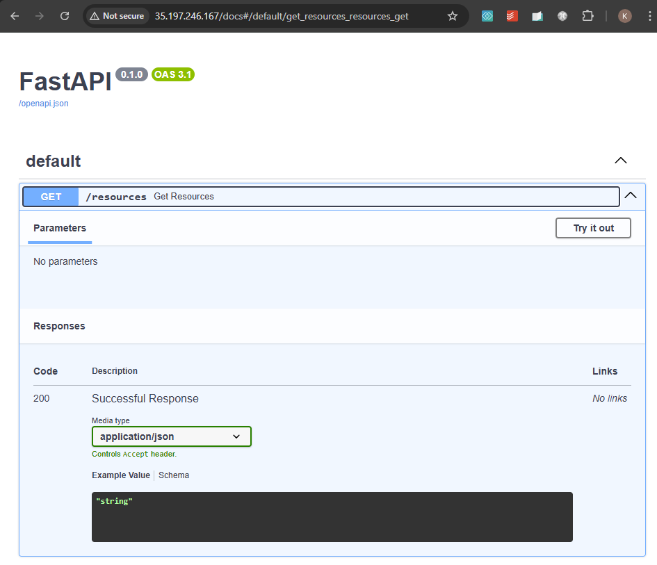

# Simple Kubernetes Customer Resource and Operator <!-- omit from toc -->

Contents
- [Overview](#overview)
- [Prerequisites](#prerequisites)
- [Deploy the Lab](#deploy-the-lab)
- [Troubleshooting](#troubleshooting)
- [Initial Setup](#initial-setup)
- [(Optional) Testing the Operator (locally)](#optional-testing-the-operator-locally)
- [Testing the Operator (GKE)](#testing-the-operator-gke)
  - [SORT](#sort)
- [Cleanup](#cleanup)
- [Useful Commands](#useful-commands)
- [Requirements](#requirements)
- [Inputs](#inputs)
- [Outputs](#outputs)


## Overview

This lab deploys a GKE ingress pattern to allow access from a hub to spoke clusters. The hub ingress, haproxy, performs service discovery and routing to the spoke clusters. The ingress uses host names in SNI to route traffic to the correct cluster.


## Prerequisites

1. Ensure you meet all requirements in the [prerequisites](../../prerequisites/README.md) before proceeding.
2. [Install skaffold](https://skaffold.dev/docs/install/) for deploying the operator to the GKE cluster.
3. Install kubectx to switch between kubernetes contexts. [Install kubectx](https://github.com/ahmetb/kubectx?tab=readme-ov-file#installation)

## Deploy the Lab

1\. Clone the Git Repository for the Labs

 ```sh
 git clone https://github.com/kaysalawu/gcp-network-terraform.git
 ```

2\. Navigate to the lab directory

```sh
cd gcp-network-terraform/4-general/g5-gke-ingress
```

3\. Run the following terraform commands and type ***yes*** at the prompt:

 ```sh
 terraform init
 terraform plan
 terraform apply -parallelism=50
 ```

 ## Troubleshooting

See the [troubleshooting](../../troubleshooting/README.md) section for tips on how to resolve common issues that may occur during the deployment of the lab.


## Initial Setup

1\. Set some environment variables

```sh
PROJECT_ID=<your-project-id>
LOCATION=europe-west2
INGRESS_CLUSTER_NAME=g1-ingress-cluster
SPOKE1_CLUSTER_NAME=g1-spoke1-cluster
SPOKE2_CLUSTER_NAME=g1-spoke2-cluster
```

2\. Get the GKE cluster credentials

```sh
gcloud container clusters get-credentials $CLUSTER_NAME --region "$LOCATION-b" --project=$PROJECT_ID
```

3\. Create the python virtual environment

```sh
cd $APP_PATH
python3 -m venv ping-venv
source ping-venv/bin/activate
pip install kopf fastapi kubernetes uvicorn
pip freeze > requirements.txt
```

## (Optional) Testing the Operator (locally)

1\. Create the PingResource Custom Resource Definition (CRD)

```sh
cd ../manifests/kustomize/base/main
kubectl apply -f pingresource-crd.yaml
```

2\. Confirm the CRD is created

```sh
kubectl get crd pingresources.example.com
```

Sample Output:

```sh
(ping-venv) base$ kubectl get crd pingresources.example.com
NAME                        CREATED AT
pingresources.example.com   2025-01-08T06:56:17Z
(ping-venv) base$
```

3\. Run the operator locally

```sh
cd ../../../app/operator/
kopf run ping_operator-local.py
```

<details>

<summary>Sample output</summary>

```sh
(ping-venv) operator$ kopf run ping_operator-local.py
/home/salawu/GCP/gcp-network-terraform/4-general/g1-k8s-custom-resource/artifacts/ping/app/ping-venv/lib/python3.11/site-packages/kopf/_core/reactor/running.py:179: FutureWarning: Absence of either namespaces or cluster-wide flag will become an error soon. For now, switching to the cluster-wide mode for backward compatibility.
  warnings.warn("Absence of either namespaces or cluster-wide flag will become an error soon."
[2025-01-08 07:05:26,490] kopf._core.engines.a [INFO    ] Initial authentication has been initiated.
[2025-01-08 07:05:26,515] kopf.activities.auth [INFO    ] Activity 'login_via_client' succeeded.
[2025-01-08 07:05:26,515] kopf._core.engines.a [INFO    ] Initial authentication has finished.
```

</details>
<p>

4\. In a new terminal in the same directory, create a PingResource custom resource

```sh
kubectl apply -f ../../manifests/kustomize/overlays/ping-resources/pingresource-sample.yaml
```

5\. Confirm the custom resource is created

```sh
kubectl get pingresource test-ping -o yaml
```

<details>

<summary>Sample output</summary>

```sh
operator$ kubectl get pingresource test-ping -o yaml
apiVersion: example.com/v1
kind: PingResource
metadata:
  annotations:
    kopf.zalando.org/last-handled-configuration: |
      {"spec":{"message":"Ping"}}
    kubectl.kubernetes.io/last-applied-configuration: |
      {"apiVersion":"example.com/v1","kind":"PingResource","metadata":{"annotations":{},"name":"test-ping","namespace":"default"},"spec":{"message":"Ping"}}
  creationTimestamp: "2025-01-08T07:06:19Z"
  finalizers:
  - kopf.zalando.org/KopfFinalizerMarker
  generation: 2
  name: test-ping
  namespace: default
  resourceVersion: "122393"
  uid: 18a5fe69-5e64-45a0-ae1c-dbb7e64f19fd
spec:
  message: Ping
status:
  response: Ping - Pong
```

</details>
<p  >

We can see that the message is `ping` and the response is `ping - pong` which is the expected output.

😎 For the fun of it, let's create an almost useless control plane that watches the custom resource and prints a message when a custom resource is created or deleted.


6\. In the current (second) terminal, run the control plane locally

```sh
cd ../control-plane/
source ../ping-venv/bin/activate
python -m uvicorn control_plane-local:app --reload --host 0.0.0.0 --port 9000
```

<details>

<summary>Sample output</summary>

```sh
(ping-venv) control-plane$ python -m uvicorn control_plane-local:app --reload --host 0.0.0.0 --port 9000
INFO:     Will watch for changes in these directories: ['/home/salawu/GCP/gcp-network-terraform/4-general/g1-k8s-custom-resource/artifacts/ping/app/control-plane']
INFO:     Uvicorn running on http://0.0.0.0:9000 (Press CTRL+C to quit)
INFO:     Started reloader process [73643] using statreload
Started monitoring PingResource events...
INFO:     Started server process [73645]
INFO:     Waiting for application startup.
INFO:     Application startup complete.
Resource test-ping added.
```

</details>
<p>

7\. In a new (third) terminal, check the control plane for CRD events

```sh
curl -X GET "http://127.0.0.1:9000/resources" -H "Content-Type: application/json"
```

Sample Output:

```json
{"resources":{"test-ping":"created"}}
```

In step 4, we created the custom resource using **kubectl**. We will now create the custom resource programatically using an API server implemented in FastAPI.

8\. In a new (fourth) terminal, run the API server

```sh
cd ../api-server/
source ../ping-venv/bin/activate
python -m uvicorn ping_api:app --reload --host 0.0.0.0 --port 8000
```

<details>

<summary>Sample output</summary>

```sh
(ping-venv) api-server$ python -m uvicorn ping_api-local:app --reload --host 0.0.0.0 --port 8000
INFO:     Will watch for changes in these directories: ['/home/salawu/GCP/gcp-network-terraform/4-general/g1-k8s-custom-resource/artifacts/ping/app/api-server']
INFO:     Uvicorn running on http://0.0.0.0:8000 (Press CTRL+C to quit)
INFO:     Started reloader process [74140] using statreload
INFO:     Started server process [74142]
INFO:     Waiting for application startup.
INFO:     Application startup complete.
```

</details>
<p>

9\. Back in the third terminal, run various tests on the API endpoint and verify that the control plane receives the events

- 9.1 Create `test-ping1` resource

   ```sh
   curl -X POST "http://127.0.0.1:8000/api/create_ping" -H "Content-Type: application/json" -d '{"name": "test-ping1", "message": "Hello from FastAPI"}'
   curl -X GET "http://127.0.0.1:9000/resources" -H "Content-Type: application/json"
   ```

  Sample output

  ```json
  {"status":"success","name":"test-ping1"}
  {"resources":{"test-ping":"created","test-ping1":"created"}}
  ```

  We can see that the API server returned **success** for teh creation of test-ping1 resource and teh control plane registered the event.

- 9.2 Add `test-ping2` resource

  ```sh
  curl -X POST "http://127.0.0.1:8000/api/create_ping" -H "Content-Type: application/json" -d '{"name": "test-ping2", "message": "Hello from FastAPI"}'
  curl -X GET "http://127.0.0.1:9000/resources" -H "Content-Type: application/json"
  ```

  Sample output

  ```json
  {"status":"success","name":"test-ping2"}
  {"resources":{"test-ping":"created","test-ping1":"created","test-ping2":"created"}}
  ```

- 9.3 Use kubectl to verify the custom resources

  ```sh
  kubectl get pingresources
  ```

  Sample output

  ```sh
  python$ kubectl get pingresources
  NAME         AGE
  test-ping    37m
  test-ping1   9m
  test-ping2   4m5s
  ```

- 9.4 Delete `test-ping1` resource using kubectl and verify control plane events

  ```sh
  kubectl delete pingresource test-ping2
  curl -X GET "http://127.0.0.1:9000/resources" -H "Content-Type: application/json"
  ```

  Sample output

  ```json
  pingresource.example.com "test-ping2" deleted
  {"resources":{"test-ping":"created","test-ping1":"created"}}
  ```

- 9.5 Delete `test-ping1` resource using the API server and verify control plane events

  ```sh
  curl -X DELETE "http://127.0.0.1:8000/api/delete_ping/test-ping1"
  curl -X GET "http://127.0.0.1:9000/resources" -H "Content-Type: application/json"
  ```

  Sample output

  ```json
  {"status":"success","message":"Resource test-ping1 deleted"}
  {"resources":{"test-ping":"created"}}
  ```

  We have successfully tested the operator locally.

10\.   Delete the CRD and pingresource sample

  ```sh
  kubectl delete -f ../../manifests/kustomize/overlays/ping-resources/pingresource-sample.yaml
  kubectl delete -f ../../manifests/kustomize/base/main/pingresource-crd.yaml
  ```

11\.   Stop the control plane and API server by pressing `Ctrl+C` in the respective terminals.

## Testing the Operator (GKE)

1\. Deploy the operator, control plane and API server using skaffold

```sh
cd artifacts
skaffold run
```

2\. Confirm the operator is running

```sh
kubectl get pods
```

Sample output

```sh
artifacts$ kubectl get pods
NAME                             READY   STATUS    RESTARTS   AGE
api-server-5ff4d7b6cb-7ndh8      1/1     Running   0          56s
control-plane-6b98d95f97-s64rt   1/1     Running   0          56s
ping-operator-64fcffb9d8-2sdv4   1/1     Running   0          56s
```

3\. Confirm the CRD is created

```sh
kubectl get crd pingresources.example.com
```

Sample output

```sh
artifacts$ kubectl get crd pingresources.example.com
NAME                        CREATED AT
pingresources.example.com   2025-01-08T08:45:51Z
```

4\. Confirm the load balancer IP addresses

```sh
kubectl get svc
```

Sample output

```sh
artifacts$ kubectl get svc
NAME                 TYPE           CLUSTER-IP     EXTERNAL-IP      PORT(S)        AGE
api-server-elb       LoadBalancer   10.1.102.123   34.142.15.176    80:30889/TCP   76m
api-server-service   ClusterIP      10.1.102.125   <none>           8080/TCP       99m
control-plane        ClusterIP      10.1.102.32    <none>           9000/TCP       70m
control-plane-elb    LoadBalancer   10.1.102.176   35.197.246.167   80:30298/TCP   74m
kubernetes           ClusterIP      10.1.102.1     <none>           443/TCP        6h26m
```

5\. Extract the external IP addresses and create `test-ping1` resource

```sh
API_SERVER_IP=$(kubectl get svc api-server-elb -o jsonpath='{.status.loadBalancer.ingress[0].ip}')
curl -X POST "http://$API_SERVER_IP/api/create_ping" -H "Content-Type: application/json" -d '{"name": "test-ping1", "message": "Hello from FastAPI"}'
```

Sample output

```json
{"status":"success","name":"test-ping1"}
```

6\. Confirm the control plane events

```sh
CONTROL_PLANE_IP=$(kubectl get svc control-plane-elb -o jsonpath='{.status.loadBalancer.ingress[0].ip}')
curl -X GET "http://$CONTROL_PLANE_IP/resources" -H "Content-Type: application/json"
```

Sample output

```json
{"resources":{"test-ping1":"created"}}
```

7\. Create `test-ping2` resource

```sh
curl -X POST "http://$API_SERVER_IP/api/create_ping" \
-H "Content-Type: application/json" \
-d '{"name": "test-ping2", "message": "Hello from FastAPI"}'
```

Sample output

```json
{"status":"success","name":"test-ping2"}
```

8\. (Optional) Test API server using FastApi web interface

Go to `http://$API_SERVER_IP/docs` in your browser and test the API server.


9\. (Optional) Test control plane using FastApi web interface

Go to `http://$CONTROL_PLANE_IP/docs` in your browser and test the control plane.



10\. Delete the resources

```sh
curl -X DELETE "http://$API_SERVER_IP/api/delete_ping/test-ping1"
curl -X DELETE "http://$API_SERVER_IP/api/delete_ping/test-ping2"
skaffold delete
```

### SORT

##############
From hub pod
The in-cluster Kubernetes configuration is stored as files in that directory. Check the files like this:
root@gcloud:/# ls /var/run/secrets/kubernetes.io/serviceaccount
ca.crt  namespace  token

The context is automatically inferred by kubectl from the in-cluster configuration, specifically:

API server URL from the Kubernetes environment variable KUBERNETES_SERVICE_HOST and KUBERNETES_SERVICE_PORT.
Credentials from /var/run/secrets/kubernetes.io/serviceaccount (token, namespace, and CA cert).

gte local pods
root@gcloud:/# kubectl get pods
NAME       READY   STATUS    RESTARTS   AGE
gcloud     1/1     Running   0          42m
netshoot   1/1     Running   0          42m


get spoke2 pods
root@gcloud:/# gcloud container clusters get-credentials g5-spoke2-eu-cluster --region europe-west2-b --project prj-spoke2-lab
Fetching cluster endpoint and auth data.
kubeconfig entry generated for g5-spoke2-eu-cluster.
root@gcloud:/# kubectl get pods
NAME       READY   STATUS    RESTARTS   AGE
gcloud     1/1     Running   0          26m
netshoot   1/1     Running   0          26m

root@gcloud:/# kubectl describe pod gcloud
Name:             gcloud
Namespace:        default
Priority:         0
Service Account:  cluster-ksa
Node:             gke-g5-spoke2-eu-clu-g5-spoke2-eu-clu-9f95abe1-jpd4/10.22.12.3
Start Time:       Sun, 26 Jan 2025 12:30:59 +0000
Labels:           skaffold.dev/run-id=d292403c-d0b5-4cad-825b-22ca8495dc99
Annotations:      <none>
Status:           Running
IP:               10.22.100.11
IPs:
  IP:  10.22.100.11
Containers:
  gcloud:
    Container ID:  containerd://4941ad3253c8b14ac848e27d5fb1e4ee109cce3bbd637061522ad6b99f592b57
    Image:         google/cloud-sdk:latest
    Image ID:      docker.io/google/cloud-sdk@sha256:7ad5616cf9abbbb7525e38ea83671f5f1389cedcec0c7244cca68e005717bb7f
    Port:          <none>
    Host Port:     <none>
    Command:
      sleep
      infinity
    State:          Running
      Started:      Sun, 26 Jan 2025 12:32:23 +0000
    Ready:          True
    Restart Count:  0
    Environment:    <none>
    Mounts:
      /var/run/secrets/kubernetes.io/serviceaccount from kube-api-access-rl8xp (ro)
Conditions:
  Type                        Status
  PodReadyToStartContainers   True
  Initialized                 True
  Ready                       True
  ContainersReady             True
  PodScheduled                True
Volumes:
  kube-api-access-rl8xp:
    Type:                    Projected (a volume that contains injected data from multiple sources)
    TokenExpirationSeconds:  3607
    ConfigMapName:           kube-root-ca.crt
    ConfigMapOptional:       <nil>
    DownwardAPI:             true
QoS Class:                   BestEffort
Node-Selectors:              <none>
Tolerations:                 node.kubernetes.io/not-ready:NoExecute op=Exists for 300s
                             node.kubernetes.io/unreachable:NoExecute op=Exists for 300s
Events:
  Type    Reason     Age   From               Message
  ----    ------     ----  ----               -------
  Normal  Scheduled  26m   default-scheduler  Successfully assigned default/gcloud to gke-g5-spoke2-eu-clu-g5-spoke2-eu-clu-9f95abe1-jpd4
  Normal  Pulling    26m   kubelet            Pulling image "google/cloud-sdk:latest"
  Normal  Pulled     25m   kubelet            Successfully pulled image "google/cloud-sdk:latest" in 1m23.199s (1m23.199s including waiting). Image size: 1313001752 bytes.
  Normal  Created    25m   kubelet            Created container gcloud
  Normal  Started    25m   kubelet            Started container gcloud

root@gcloud:/# kubectl get pods -o wide
NAME       READY   STATUS    RESTARTS   AGE   IP             NODE                                                  NOMINATED NODE   READINESS GATES
gcloud     1/1     Running   0          28m   10.22.100.11   gke-g5-spoke2-eu-clu-g5-spoke2-eu-clu-9f95abe1-jpd4   <none>           <none>
netshoot   1/1     Running   0          28m   10.22.100.10   gke-g5-spoke2-eu-clu-g5-spoke2-eu-clu-9f95abe1-jpd4   <none>           <none>

now test python script

```sh
root@gcloud:/# kubectl config current-context
gke_prj-spoke2-lab_europe-west2-b_g5-spoke2-eu-cluster

root@gcloud:/# kubectl config delete-context gke_prj-spoke2-lab_europe-west2-b_g5-spoke2-eu-cluster
warning: this removed your active context, use "kubectl config use-context" to select a different one
deleted context gke_prj-spoke2-lab_europe-west2-b_g5-spoke2-eu-cluster from /root/.kube/config

kubectl config unset contexts.gke_prj-spoke2-lab_europe-west2-b_g5-spoke2-eu-cluster
kubectl config unset current-context

apt install -y python3.11-venv
python3 -m venv /tmp/venv
source /tmp/venv/bin/activate
pip install kubernetes

```

```python
from kubernetes import client, config
from google.auth.transport.requests import Request
from google.oauth2 import id_token
import requests

# Generate a GCP access token for the spoke2 cluster
def get_gcp_token(project_id, cluster_name, region):
    url = f"https://container.googleapis.com/v1/projects/{project_id}/locations/{region}/clusters/{cluster_name}"
    token_request = Request()
    token = id_token.fetch_id_token(token_request, url)
    return token

# Configure Kubernetes API dynamically for spoke2
def configure_k8s_api(cluster_endpoint, token):
    configuration = client.Configuration()
    configuration.host = f"https://{cluster_endpoint}"
    configuration.verify_ssl = True
    configuration.api_key = {"authorization": f"Bearer {token}"}
    client.Configuration.set_default(configuration)

# List pods in spoke2
def list_spoke2_pods(project_id, cluster_name, region):
    token = get_gcp_token(project_id, cluster_name, region)
    configure_k8s_api("spoke2-cluster-endpoint", token)  # Replace with actual spoke2 API endpoint
    v1 = client.CoreV1Api()
    pods = v1.list_pod_for_all_namespaces()
    for pod in pods.items:
        print(f"Pod: {pod.metadata.name}, Namespace: {pod.metadata.namespace}")

if __name__ == "__main__":
    list_spoke2_pods("prj-spoke2-lab", "g5-spoke2-eu-cluster", "europe-west2")
```


##############
```sh
artifacts$ k get pods
NAME                        READY   STATUS      RESTARTS      AGE
endpoints-d7fd7f8fb-9lnt2   0/1     Completed   2 (20s ago)   27s
gcloud                      1/1     Running     0             9h
netshoot                    1/1     Running     0             9h
artifacts$
artifacts$
artifacts$
artifacts$
artifacts$ k logs endpoints-d7fd7f8fb-9lnt2
Fetching cluster endpoint and auth data.
kubeconfig entry generated for g5-spoke2-eu-cluster.
[
  {
    "name": "gcloud",
    "podIP": "10.22.100.11",
    "hostIP": "10.22.12.3",
    "phase": "Running"
  },
  {
    "name": "netshoot",
    "podIP": "10.22.100.10",
    "hostIP": "10.22.12.3",
    "phase": "Running"
  }
]
```


## Cleanup

1\. (Optional) Navigate back to the lab directory (if you are not already there).

```sh
cd gcp-network-terraform/4-general/g5-gke-ingress
```

2\. Run terraform destroy.

```sh
terraform destroy -auto-approve
```

## Useful Commands

1\. Force delete PingResource custom resource

```sh
kubectl patch pingresource test-ping1 -p '{"metadata":{"finalizers":[]}}' --type=merge
```

<!-- BEGIN_TF_DOCS -->
## Requirements

No requirements.

## Inputs

| Name | Description | Type | Default | Required |
|------|-------------|------|---------|:--------:|
| <a name="input_folder_id"></a> [folder\_id](#input\_folder\_id) | folder id | `any` | `null` | no |
| <a name="input_organization_id"></a> [organization\_id](#input\_organization\_id) | organization id | `any` | `null` | no |
| <a name="input_prefix"></a> [prefix](#input\_prefix) | prefix used for all resources | `string` | `"g1"` | no |
| <a name="input_project_id_hub"></a> [project\_id\_hub](#input\_project\_id\_hub) | hub project id | `any` | n/a | yes |

## Outputs

No outputs.
<!-- END_TF_DOCS -->
