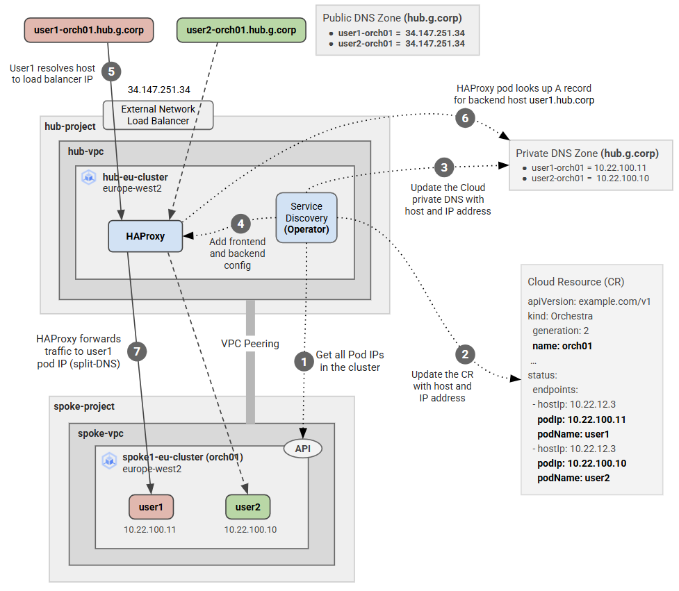

# Simple Kubernetes Customer Resource and Operator <!-- omit from toc -->

Contents
- [Overview](#overview)
- [Prerequisites](#prerequisites)
- [Troubleshooting](#troubleshooting)
- [Initial Setup](#initial-setup)
- [Deploy the Spoke Cluster](#deploy-the-spoke-cluster)
- [Deploy the Hub Cluster](#deploy-the-hub-cluster)
- [Deploy the Custom Resource (CR)](#deploy-the-custom-resource-cr)
  - [SORT](#sort)
- [Cleanup](#cleanup)
- [Useful Commands](#useful-commands)
- [Requirements](#requirements)
- [Inputs](#inputs)
- [Outputs](#outputs)


## Overview

This lab deploys a GKE ingress pattern to allow access from a hub to spoke clusters. The hub ingress, haproxy, performs service discovery and routing to the spoke clusters. The ingress uses host names in SNI to route traffic to the correct cluster.

Service discovery is implemented using a simple Kubernetes custom resource (CR) and operator. The operator watches for the custom resource and updates the Cloud DNS with pod IP addresses when the custom resource is created or deleted. In this example, the CR represents a kubernetes cluster. The CR has a status field that is updated with the cluster's pod IP addresses.



The lab infrastructure is a hub and spoke model. The hub cluster is in a separate project from the spoke clusters. The spoke clusters are in different regions. The hub cluster has a haproxy ingress that routes traffic to the spoke clusters based on the host name in the SNI.

## Prerequisites

1. Ensure you meet all requirements in the [prerequisites](../../prerequisites/README.md) before proceeding.
2. [Install skaffold](https://skaffold.dev/docs/install/) for deploying the operator to the GKE cluster.
3. Install kubectx to switch between kubernetes contexts. [Install kubectx](https://github.com/ahmetb/kubectx?tab=readme-ov-file#installation)
4. Install [skaffold](https://skaffold.dev/docs/install/#standalone-binary), the tool we'll use for building and deploying to Kubernetes.
5. Create two GCP projects, one for the hub and the other for the spoke clusters.
6. (Optional) Install graphviz for visualizing the state machine. [Install graphviz](https://graphviz.gitlab.io/download/)

```sh
sudo apt update
sudo apt install graphviz graphviz-dev


## Deploy the Lab

1. Clone the Git Repository for the Labs

    ```sh
    git clone https://github.com/kaysalawu/gcp-network-terraform.git
    ```

2. Navigate to the lab directory

   ```sh
   cd gcp-network-terraform/4-general/g5-gke-ingress
   ```

3. Run the following terraform commands and type ***yes*** at the prompt:

    ```sh
    terraform init
    terraform plan
    terraform apply -auto-approve
    ```

 ## Troubleshooting

See the [troubleshooting](../../troubleshooting/README.md) section for tips on how to resolve common issues that may occur during the deployment of the lab.


## Initial Setup

1. Set some environment variables

```sh
export PROJECT_ID_HUB=<your-hub-project-id>
export PROJECT_ID_SPOKE=<your-spoke-project-id>
export LOCATION=europe-west2
export HUB_CLUSTER_NAME=g5-hub-eu-cluster
export SPOKE_CLUSTER1_NAME=g5-spoke2-eu-cluster
```

1. Get the GKE cluster credentials

```sh
gcloud container clusters get-credentials $SPOKE_CLUSTER1_NAME --region "$LOCATION-b" --project=$PROJECT_ID_SPOKE
gcloud container clusters get-credentials $HUB_CLUSTER_NAME --region "$LOCATION-b" --project=$PROJECT_ID_HUB
```

## Deploy the Spoke Cluster

A skaffold file is located at [artifacts/skaffold.yaml](./artifacts/skaffold.yaml) with different profiles for deploying various components.

1. Navigate to the artifacts directory

```sh
cd artifacts
```

1. Switch to the spoke cluster context

```sh
kubectx gke_${PROJECT_ID_SPOKE}_${LOCATION}-b_${SPOKE_CLUSTER1_NAME}
```

1. Deploy the spoke workload

```sh
skaffold run -p workload
```

1. Confirm the pods are running

```sh
kubectl get pods
```

Sample output

```sh
artifacts$ kubectl get pods
NAME    READY   STATUS    RESTARTS   AGE
user1   3/3     Running   0          35s
user2   3/3     Running   0          35s
```

## Deploy the Hub Cluster

Let's deploy the operator and API server to the hub cluster.

1. Switch to the hub cluster context

```sh
kubectx gke_${PROJECT_ID_HUB}_${LOCATION}-b_${HUB_CLUSTER_NAME}
```

1. Deploy the operator

```sh
skaffold run -p operator
```

Check the operator logs to verify it is running

```sh
kubectx gke_${PROJECT_ID_HUB}_${LOCATION}-b_${HUB_CLUSTER_NAME} && \
kubectl logs $(kubectl get pods --no-headers -o custom-columns=":metadata.name" | grep operator)
```

<Details>

<summary>Sample Output</summary>

```sh
artifacts$ kubectl logs $(kubectl get pods --no-headers -o custom-columns=":metadata.name" | grep operator)
[2025-02-03 08:39:47,012] root                 [INFO    ] Project ID: prj-hub-lab
[2025-02-03 08:39:47,790] root                 [INFO    ] Private DNS zone: [{'name': 'g5-hub-private', 'dns_name': 'hub.g.corp.', 'description': 'local data'}]
[2025-02-03 08:39:47,793] __kopf_script_0__/ap [INFO    ] [LOG] Initializing pod scanner...
[2025-02-03 08:39:47,794] kopf.activities.star [INFO    ] Activity 'start_scanner' succeeded.
[2025-02-03 08:39:47,795] kopf._core.engines.a [INFO    ] Initial authentication has been initiated.
[2025-02-03 08:39:47,797] kopf.activities.auth [INFO    ] Activity 'login_via_client' succeeded.
[2025-02-03 08:39:47,798] kopf._core.engines.a [INFO    ] Initial authentication has finished.
[2025-02-03 08:39:48,116] __kopf_script_0__/ap [INFO    ] CRs Found: []
[2025-02-03 08:40:08,281] __kopf_script_0__/ap [INFO    ] CRs Found: []
```

</Details>
<p>

The oprator is running and watching for custom resources. Currently, there are no custom resources in the cluster. We will deploy the CR later.

1. Deploy the API server

```sh
skaffold run -p api-server
```

Check the API server logs to verify it is running

```sh
kubectl logs $(kubectl get pods --no-headers -o custom-columns=":metadata.name" | grep api-server)
```

<Details>

<summary>Sample Output</summary>

```sh
artifacts$ kubectl logs $(kubectl get pods --no-headers -o custom-columns=":metadata.name" | grep api-server)
INFO:     Started server process [1]
INFO:     Waiting for application startup.
INFO:     Application startup complete.
INFO:     Uvicorn running on http://0.0.0.0:8080 (Press CTRL+C to quit)
```

</Details>
<p>

The API server (FastAPI) is running. The API server is also exposed on external load balancer.

1. Get the external IP address of the API server

```sh
API_SERVER_IP=$(kubectl get svc api-server-elb -o jsonpath='{.status.loadBalancer.ingress[0].ip}') && echo $API_SERVER_IP
```

You can use the web interface to test the API server. Go to `http://$API_SERVER_IP/docs` in your browser. However, we will use curl to test the API server in the next steps.

1. Deploy tool pods to the hub cluster. These are general purpose pods that can be used to test access to services.

```sh
skaffold run -p tools
```

1. Verify all pods deployed

```sh
kubectl get pods
```

Sample output

```sh
artifacts$ kubectl get pods
NAME                                  READY   STATUS    RESTARTS   AGE
api-server-6968d74f8b-vmqqc           1/1     Running   0          69m
discovery-operator-854c895fb4-6rnxb   1/1     Running   0          72m
gcloud                                1/1     Running   0          159m
netshoot                              1/1     Running   0          159m
```

## Deploy the Custom Resource (CR)

The customer rsource is `Orchestra` is a simple CR that represents a kubernetes cluster. The CR has a status field that is updated with the cluster's pod IP addresses. This can be deployed via a manifest file or using the API server.

1. Deploy the CR using the API server

```sh
curl -X 'POST' \
  'http://34.147.231.21/api/create_orchestra' \
  -H 'accept: application/json' \
  -H 'Content-Type: application/json' \
  -d '{
  "cluster": "g5-spoke2-eu-cluster",
  "ingress": "ingress-001",
  "name": "orchestra-001",
  "project": "prj-spoke2-lab",
  "zone": "europe-west2-b"
}'
```

Check the operator logs to verify the CR was created

```sh
[2025-02-03 13:01:19,741] __kopf_script_0__/ap [INFO    ] CRs Found: []
[2025-02-03 13:01:39,922] __kopf_script_0__/ap [INFO    ] CRs Found: []
[2025-02-03 13:01:46,359] __kopf_script_0__/ap [INFO    ] Orchestra CREATE: orchestra-001.
[2025-02-03 13:01:46,360] __kopf_script_0__/ap [INFO    ] Endpoints: Scanning... orchestra-001
Fetching cluster endpoint and auth data.
kubeconfig entry generated for g5-spoke2-eu-cluster.
[2025-02-03 13:01:48,159] _PodManager          [INFO    ] Context switch: -> gke_prj-spoke2-lab_europe-west2-b_g5-spoke2-eu-cluster
[2025-02-03 13:01:48,330] __kopf_script_0__/ap [INFO    ] Endpoints: Found [2] -> g5-spoke2-eu-cluster
Property "current-context" unset.
[2025-02-03 13:01:48,445] _PodManager          [INFO    ] Context switch: -> in-cluster
[2025-02-03 13:01:48,462] __kopf_script_0__/ap [INFO    ] CR Update: Success! orchestra-001
[2025-02-03 13:01:48,462] __kopf_script_0__/ap [INFO    ] DNS Reconcile: Starting... orchestra-001
[2025-02-03 13:01:49,127] utils                [INFO    ] DNS CREATE: Success! user1-orchestra-001.hub.g.corp. -> 10.22.100.14
[2025-02-03 13:01:49,533] utils                [INFO    ] DNS CREATE: Success! user2-orchestra-001.hub.g.corp. -> 10.22.100.15
[2025-02-03 13:01:49,535] kopf.objects         [INFO    ] [default/orchestra-001] Handler 'on_orchestra_create' succeeded.
[2025-02-03 13:01:49,536] kopf.objects         [INFO    ] [default/orchestra-001] Creation is processed: 1 succeeded; 0 failed.
```

Once the CR is created, th eoperator runs the following tasks:
- Detects the spoke cluster pods `user1` and `user2`
- Fetches the pod IP addresses
- Updates the CR status with the pod IP addresses
- Updates the Cloud DNS with the pod IP addresses

The operator indefinitely loops through the CRs and performs the same tasks in 20s intervals.


Now let's delete a pod on spoke2 cluster and check the operator logs

1. Switch to the spoke cluster context

```sh
kubectx gke_${PROJECT_ID_SPOKE}_${LOCATION}-b_${SPOKE_CLUSTER1_NAME} &&\
kubectl delete pod user1
```

1. Verify the operator logs

```sh
kubectx gke_${PROJECT_ID_HUB}_${LOCATION}-b_${HUB_CLUSTER_NAME} && \
kubectl logs $(kubectl get pods --no-headers -o custom-columns=":metadata.name" | grep operator)
```

```sh
[2025-02-03 13:08:54,384] __kopf_script_0__/ap [INFO    ] CRs Found: ['orchestra-001']
[2025-02-03 13:08:54,386] __kopf_script_0__/ap [INFO    ] Endpoints: Scanning... orchestra-001
Fetching cluster endpoint and auth data.
kubeconfig entry generated for g5-spoke2-eu-cluster.
[2025-02-03 13:08:56,169] _PodManager          [INFO    ] Context switch: -> gke_prj-spoke2-lab_europe-west2-b_g5-spoke2-eu-cluster
[2025-02-03 13:08:56,314] __kopf_script_0__/ap [INFO    ] Endpoints: Found [1] -> g5-spoke2-eu-cluster
Property "current-context" unset.
[2025-02-03 13:08:56,430] _PodManager          [INFO    ] Context switch: -> in-cluster
[2025-02-03 13:08:56,449] __kopf_script_0__/ap [INFO    ] CR Update: Success! orchestra-001
[2025-02-03 13:08:56,449] __kopf_script_0__/ap [INFO    ] DNS Reconcile: Starting... orchestra-001
[2025-02-03 13:08:56,901] __kopf_script_0__/ap [INFO    ] DNS Reconcile: Deleting 1 stale records for orchestra-001
[2025-02-03 13:08:57,321] utils                [INFO    ] DNS DELETE: Success! user1-orchestra-001.hub.g.corp. -> ['10.22.100.14']
```


```sh
curl -X 'DELETE' \
  'http://34.147.231.21/api/delete_orchestra/orchestra-001' \
  -H 'accept: application/json'
```

### SORT

##############
From hub pod
The in-cluster Kubernetes configuration is stored as files in that directory. Check the files like this:
root@gcloud:/# ls /var/run/secrets/kubernetes.io/serviceaccount
ca.crt  namespace  token

The context is automatically inferred by kubectl from the in-cluster configuration, specifically:

API server URL from the Kubernetes environment variable KUBERNETES_SERVICE_HOST and KUBERNETES_SERVICE_PORT.
Credentials from /var/run/secrets/kubernetes.io/serviceaccount (token, namespace, and CA cert).

gte local pods
root@gcloud:/# kubectl get pods
NAME       READY   STATUS    RESTARTS   AGE
gcloud     1/1     Running   0          42m
netshoot   1/1     Running   0          42m


get spoke2 pods
root@gcloud:/# gcloud container clusters get-credentials g5-spoke2-eu-cluster --region europe-west2-b --project prj-spoke2-lab
Fetching cluster endpoint and auth data.
kubeconfig entry generated for g5-spoke2-eu-cluster.
root@gcloud:/# kubectl get pods
NAME       READY   STATUS    RESTARTS   AGE
gcloud     1/1     Running   0          26m
netshoot   1/1     Running   0          26m

root@gcloud:/# kubectl describe pod gcloud
Name:             gcloud
Namespace:        default
Priority:         0
Service Account:  cluster-ksa
Node:             gke-g5-spoke2-eu-clu-g5-spoke2-eu-clu-9f95abe1-jpd4/10.22.12.3
Start Time:       Sun, 26 Jan 2025 12:30:59 +0000
Labels:           skaffold.dev/run-id=d292403c-d0b5-4cad-825b-22ca8495dc99
Annotations:      <none>
Status:           Running
IP:               10.22.100.11
IPs:
  IP:  10.22.100.11
Containers:
  gcloud:
    Container ID:  containerd://4941ad3253c8b14ac848e27d5fb1e4ee109cce3bbd637061522ad6b99f592b57
    Image:         google/cloud-sdk:latest
    Image ID:      docker.io/google/cloud-sdk@sha256:7ad5616cf9abbbb7525e38ea83671f5f1389cedcec0c7244cca68e005717bb7f
    Port:          <none>
    Host Port:     <none>
    Command:
      sleep
      infinity
    State:          Running
      Started:      Sun, 26 Jan 2025 12:32:23 +0000
    Ready:          True
    Restart Count:  0
    Environment:    <none>
    Mounts:
      /var/run/secrets/kubernetes.io/serviceaccount from kube-api-access-rl8xp (ro)
Conditions:
  Type                        Status
  PodReadyToStartContainers   True
  Initialized                 True
  Ready                       True
  ContainersReady             True
  PodScheduled                True
Volumes:
  kube-api-access-rl8xp:
    Type:                    Projected (a volume that contains injected data from multiple sources)
    TokenExpirationSeconds:  3607
    ConfigMapName:           kube-root-ca.crt
    ConfigMapOptional:       <nil>
    DownwardAPI:             true
QoS Class:                   BestEffort
Node-Selectors:              <none>
Tolerations:                 node.kubernetes.io/not-ready:NoExecute op=Exists for 300s
                             node.kubernetes.io/unreachable:NoExecute op=Exists for 300s
Events:
  Type    Reason     Age   From               Message
  ----    ------     ----  ----               -------
  Normal  Scheduled  26m   default-scheduler  Successfully assigned default/gcloud to gke-g5-spoke2-eu-clu-g5-spoke2-eu-clu-9f95abe1-jpd4
  Normal  Pulling    26m   kubelet            Pulling image "google/cloud-sdk:latest"
  Normal  Pulled     25m   kubelet            Successfully pulled image "google/cloud-sdk:latest" in 1m23.199s (1m23.199s including waiting). Image size: 1313001752 bytes.
  Normal  Created    25m   kubelet            Created container gcloud
  Normal  Started    25m   kubelet            Started container gcloud

root@gcloud:/# kubectl get pods -o wide
NAME       READY   STATUS    RESTARTS   AGE   IP             NODE                                                  NOMINATED NODE   READINESS GATES
gcloud     1/1     Running   0          28m   10.22.100.11   gke-g5-spoke2-eu-clu-g5-spoke2-eu-clu-9f95abe1-jpd4   <none>           <none>
netshoot   1/1     Running   0          28m   10.22.100.10   gke-g5-spoke2-eu-clu-g5-spoke2-eu-clu-9f95abe1-jpd4   <none>           <none>

now test python script

```sh
root@gcloud:/# kubectl config current-context
gke_prj-spoke2-lab_europe-west2-b_g5-spoke2-eu-cluster

root@gcloud:/# kubectl config delete-context gke_prj-spoke2-lab_europe-west2-b_g5-spoke2-eu-cluster
warning: this removed your active context, use "kubectl config use-context" to select a different one
deleted context gke_prj-spoke2-lab_europe-west2-b_g5-spoke2-eu-cluster from /root/.kube/config

kubectl config unset contexts.gke_prj-spoke2-lab_europe-west2-b_g5-spoke2-eu-cluster
kubectl config unset current-context

apt install -y python3.11-venv
python3 -m venv /tmp/venv
source /tmp/venv/bin/activate
pip install kubernetes

```

```python
from kubernetes import client, config
from google.auth.transport.requests import Request
from google.oauth2 import id_token
import requests

# Generate a GCP access token for the spoke2 cluster
def get_gcp_token(project_id, cluster_name, region):
    url = f"https://container.googleapis.com/v1/projects/{project_id}/locations/{region}/clusters/{cluster_name}"
    token_request = Request()
    token = id_token.fetch_id_token(token_request, url)
    return token

# Configure Kubernetes API dynamically for spoke2
def configure_k8s_api(cluster_endpoint, token):
    configuration = client.Configuration()
    configuration.host = f"https://{cluster_endpoint}"
    configuration.verify_ssl = True
    configuration.api_key = {"authorization": f"Bearer {token}"}
    client.Configuration.set_default(configuration)

# List pods in spoke2
def list_spoke2_pods(project_id, cluster_name, region):
    token = get_gcp_token(project_id, cluster_name, region)
    configure_k8s_api("spoke2-cluster-endpoint", token)  # Replace with actual spoke2 API endpoint
    v1 = client.CoreV1Api()
    pods = v1.list_pod_for_all_namespaces()
    for pod in pods.items:
        print(f"Pod: {pod.metadata.name}, Namespace: {pod.metadata.namespace}")

if __name__ == "__main__":
    list_spoke2_pods("prj-spoke2-lab", "g5-spoke2-eu-cluster", "europe-west2")
```


##############
```sh
artifacts$ k get pods
NAME                        READY   STATUS      RESTARTS      AGE
endpoints-d7fd7f8fb-9lnt2   0/1     Completed   2 (20s ago)   27s
gcloud                      1/1     Running     0             9h
netshoot                    1/1     Running     0             9h
artifacts$
artifacts$
artifacts$
artifacts$
artifacts$ k logs endpoints-d7fd7f8fb-9lnt2
Fetching cluster endpoint and auth data.
kubeconfig entry generated for g5-spoke2-eu-cluster.
[
  {
    "name": "gcloud",
    "podIP": "10.22.100.11",
    "hostIP": "10.22.12.3",
    "phase": "Running"
  },
  {
    "name": "netshoot",
    "podIP": "10.22.100.10",
    "hostIP": "10.22.12.3",
    "phase": "Running"
  }
]


kubectl logs $(kubectl get pods --no-headers -o custom-columns=":metadata.name" | grep endpoints)

# test the endpoinst script locally
python -m uvicorn main:app --reload --host 0.0.0.0 --port 8080


kubectl auth can-i get orchestras --as=system:serviceaccount:default:default

kopf run main.py --namespace default


USER=$(kubectl config view --minify --output 'jsonpath={.contexts[0].context.user}')
echo $USER
# gke_prj-hub-lab_europe-west2-b_g5-hub-eu-cluster
kubectl create clusterrolebinding my-user-admin --clusterrole=cluster-admin --user=$USER
# clusterrolebinding.rbac.authorization.k8s.io/my-user-admin created
kubectl auth can-i get orchestras --as=$USER


kubectl auth can-i get apis --as=$USER
kubectl auth can-i get crds --as=$USER
kubectl auth can-i get orchestras --as=$USER


kubectl config view --minify
gcloud auth print-access-token | kubectl auth can-i get pods --all-namespaces --token=$(cat)

kubectl patch orch orchestra-001 --type=json -p '[{"op": "remove", "path": "/metadata/finalizers"}]'
kubectl patch orch orch-002 --type=json -p '[{"op": "remove", "path": "/metadata/finalizers"}]'


# WORKLOADS
#------------------------------------------------

kubectl create namespace default


```


## Cleanup

1\. (Optional) Navigate back to the lab directory (if you are not already there).

```sh
cd gcp-network-terraform/4-general/g5-gke-ingress
```

2\. Run terraform destroy.

```sh
terraform destroy -auto-approve
```

## Useful Commands

1\. Force delete PingResource custom resource

```sh
kubectl patch pingresource test-ping1 -p '{"metadata":{"finalizers":[]}}' --type=merge
```

<!-- BEGIN_TF_DOCS -->
## Requirements

No requirements.

## Inputs

| Name | Description | Type | Default | Required |
|------|-------------|------|---------|:--------:|
| <a name="input_folder_id"></a> [folder\_id](#input\_folder\_id) | folder id | `any` | `null` | no |
| <a name="input_organization_id"></a> [organization\_id](#input\_organization\_id) | organization id | `any` | `null` | no |
| <a name="input_prefix"></a> [prefix](#input\_prefix) | prefix used for all resources | `string` | `"g1"` | no |
| <a name="input_project_id_hub"></a> [project\_id\_hub](#input\_project\_id\_hub) | hub project id | `any` | n/a | yes |

## Outputs

No outputs.
<!-- END_TF_DOCS -->
