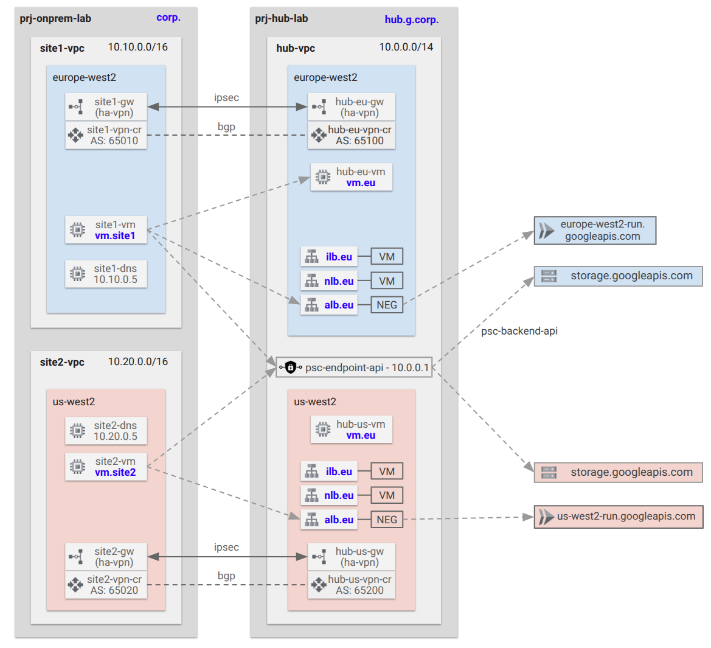

# LAB A: Hybrid with HA-VPN to On-premises <!-- omit from toc -->

Contents
- [Overview](#overview)
- [Prerequisites](#prerequisites)
- [Deploy the Lab](#deploy-the-lab)
- [Troubleshooting](#troubleshooting)
- [Outputs](#outputs)
- [Test Connection to Redis cache Instance](#test-connection-to-redis-cache-instance)
- [Cleanup](#cleanup)
- [Requirements](#requirements)
- [Inputs](#inputs)
- [Outputs](#outputs-1)

## Overview

In this lab:

* A hub VPC network with simple hybrid connectivity to two on-premises sites.
* All north-south and east-west traffic are allowed via VPC firewall rules.
* Hybrid connectivity to simulated on-premises sites is achieved using HA VPN.
* Network Connectivity Center (NCC) is used to connect the on-premises sites together via the external Hub VPC.
* Networking features such as Cloud DNS, PSC for Google APIs and load balancers are also deployed in this lab.



## Prerequisites

Ensure you meet all requirements in the [prerequisites](../../prerequisites/README.md) before proceeding.


## Deploy the Lab

1. Clone the Git Repository for the Labs

    ```sh
    git clone https://github.com/kaysalawu/gcp-network-terraform.git
    ```

2. Navigate to the lab directory

   ```sh
   cd gcp-network-terraform/3-labs/a-hybrid
   ```

3. (Optional) If you want to enable additional features such as IPv6, VPC flow logs and logging set the following variables to `true` in the [`01-main.tf`](./01-main.tf) file.

    | Variable    | Description                 | Default | Link             |
    | ----------- | -------------------------------------- | ------- | --------------------------- |
    | enable_ipv6 | Enable IPv6 on all supported resources | false   | [main.tf](./01-main.tf#L19) |
    |  |                             |         |

4. Run the following terraform commands and type ***yes*** at the prompt:

    ```sh
    terraform init
    terraform plan
    terraform apply -auto-approve
    ```

5. (Optional) Deploy a firewall endpoint in the hub VPC in zone europe-west2-b to match `region1` set in the config file - [00-config](./00-config.tf#L25).

   <Details>
   <Summary>🟢 Click to view the steps</Summary>

   ```sh
   export prefix=a
   export zone=europe-west2-b

   gcloud network-security firewall-endpoints create "$prefix-fwe-$zone" \
   --zone=$zone \
   --organization=$TF_VAR_organization_id \
   --billing-project=$TF_VAR_project_id_hub

   gcloud network-security firewall-endpoints list --zone=$zone --organization=$TF_VAR_organization_id
   ```

   Sample output:

   ```sh
   a-standard$ gcloud network-security firewall-endpoints list --zone=$zone --organization=$TF_VAR_organization_id
   ID                    LOCATION        STATE
   a-fwe-europe-west2-b  europe-west2-b  CREATING
   ```

   Wait until the firewall endpoint is created and the state changes to `ACTIVE` before proceeding to the next step.

   </Details>
   <p>

6. (Optional) When firewall endpoint is active, associate the endpoint with the hub VPC network.

   <Details>
   <Summary>🟢 Click to view the steps</Summary>

   ```sh
   export prefix=a
   export zone=europe-west2-b
   gcloud network-security firewall-endpoint-associations create $prefix-fwe-association \
   --project=$TF_VAR_project_id_hub \
   --zone $zone \
   --network=projects/$TF_VAR_project_id_hub/global/networks/$prefix-hub-vpc \
   --endpoint="$prefix-fwe-$zone" \
   --organization=$TF_VAR_organization_id

   gcloud network-security firewall-endpoint-associations list --project $TF_VAR_project_id_hub --zone=$zone
   ```

   Sample output:

   ```sh
   examples$ gcloud network-security firewall-endpoint-associations list --project $TF_VAR_project_id_hub --zone=$zone
   ID                 LOCATION        NETWORK    ENDPOINT              STATE
   a-fwe-association  europe-west2-b  a-hub-vpc  a-fwe-europe-west2-b  CREATING
   ```

   Wait a few minutes for the state to change from `CREATING` to `ACTIVE`.

   </Details>
   <p>

## Troubleshooting

See the [troubleshooting](../../troubleshooting/README.md) section for tips on how to resolve common issues that may occur during the deployment of the lab.

## Outputs

The table below shows the auto-generated output files from the lab. They are located in the `_output` directory.

| Item   | Description                | Location                                    |
| ----------------- | ------------------------------------- | ------------------------------------------------------ |
| Hub Unbound DNS   | Unbound DNS configuration  | [_output/hub-unbound.sh](./_output/hub-unbound.sh)     |
| Site1 Unbound DNS | Unbound DNS configuration  | [_output/site1-unbound.sh](./_output/site1-unbound.sh) |
| Site2 Unbound DNS | Unbound DNS configuration  | [_output/site2-unbound.sh](./_output/site2-unbound.sh) |
| Web server        | Python Flask web server, test scripts | [_output/vm-startup.sh](./_output/startup.sh)       |
|        |                            |                                             |

## Test Connection to Redis cache Instance

1. Get the IP addresses of postgres and redis instances.

   ```sh
   export PROJECT_ID=<your-project-id>
   export POSTGRES_INSTANCE=a-hub-netbox-db
   export REDIS_INSTANCE=a-hub-netbox-cache
   export DNS_SUFFIX=hub.g.corp
   export GCP_REGION=europe-west2
   export GCP_ZONE=europe-west2-b
   export TEST_VM=a-hub-eu-vm
   export POSTGRES_PORT=5432
   export POSTGRES_HOST=$(gcloud beta sql instances describe $POSTGRES_INSTANCE --project $PROJECT_ID --format="value(ipAddresses.ipAddress)")
   export REDIS_HOST=$(gcloud redis instances describe $REDIS_INSTANCE --project $PROJECT_ID --region $GCP_REGION --format="value(host)")
   export REDIS_PORT=$(gcloud redis instances describe $REDIS_INSTANCE --project $PROJECT_ID --region $GCP_REGION --format="value(port)")
   ```

2. Test netcat connection to the instances from the test VM `a-hub-eu-vm`

   ```sh
   gcloud compute ssh $TEST_VM --project $PROJECT_ID --zone $GCP_ZONE -- nc -zv $POSTGRES_INSTANCE.$DNS_SUFFIX $POSTGRES_PORT
   gcloud compute ssh $TEST_VM --project $PROJECT_ID --zone $GCP_ZONE -- nc -zv $REDIS_INSTANCE.$DNS_SUFFIX $REDIS_PORT
   ```

   Sample output:

   ```sh
   g6-netbox-ipam$    gcloud compute ssh $TEST_VM --project $PROJECT_ID --zone $GCP_ZONE -- nc -zv $POSTGRES_INSTANCE.$DNS_SUFFIX $POSTGRES_PORT
   gcloud compute ssh $TEST_VM --project $PROJECT_ID --zone $GCP_ZONE -- nc -zv $REDIS_INSTANCE.$DNS_SUFFIX $REDIS_PORT
   External IP address was not found; defaulting to using IAP tunneling.
   Connection to a-hub-netbox-db.hub.g.corp (10.1.121.3) 5432 port [tcp/postgresql] succeeded!
   Connection to compute.8471063747332467851 closed.
   External IP address was not found; defaulting to using IAP tunneling.
   Connection to a-hub-netbox-cache.hub.g.corp (10.1.120.4) 6379 port [tcp/redis] succeeded!
   Connection to compute.8471063747332467851 closed.
   ```

## Cleanup

Let's clean up the resources deployed.

1. (Optional) Navigate back to the lab directory (if you are not already there).

   ```sh
   cd gcp-network-terraform/3-labs/a-hybrid
   ```

2. Run terraform destroy.

   ```sh
   terraform destroy -auto-approve
   ```

<!-- BEGIN_TF_DOCS -->
## Requirements

No requirements.

## Inputs

| Name | Description | Type | Default | Required |
|------|-------------|------|---------|:--------:|
| <a name="input_folder_id"></a> [folder\_id](#input\_folder\_id) | folder id | `any` | `null` | no |
| <a name="input_organization_id"></a> [organization\_id](#input\_organization\_id) | organization id | `any` | `null` | no |
| <a name="input_prefix"></a> [prefix](#input\_prefix) | prefix used for all resources | `string` | `"b"` | no |
| <a name="input_project_id_host"></a> [project\_id\_host](#input\_project\_id\_host) | host project id | `any` | n/a | yes |
| <a name="input_project_id_hub"></a> [project\_id\_hub](#input\_project\_id\_hub) | hub project id | `any` | n/a | yes |
| <a name="input_project_id_onprem"></a> [project\_id\_onprem](#input\_project\_id\_onprem) | onprem project id (for onprem site1 and site2) | `any` | n/a | yes |

## Outputs

No outputs.
<!-- END_TF_DOCS -->
