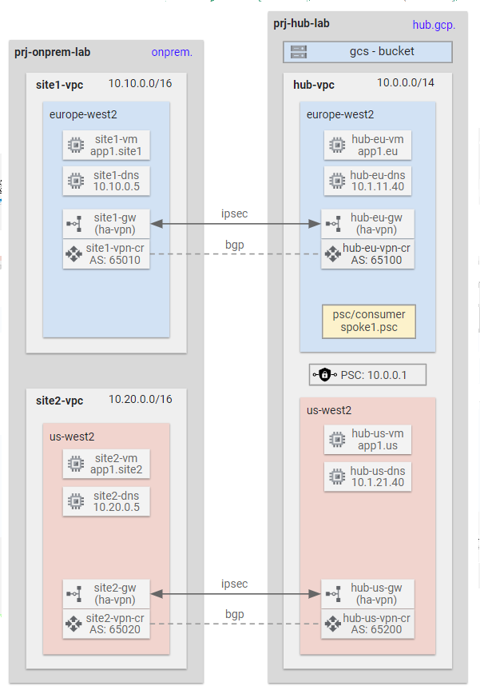
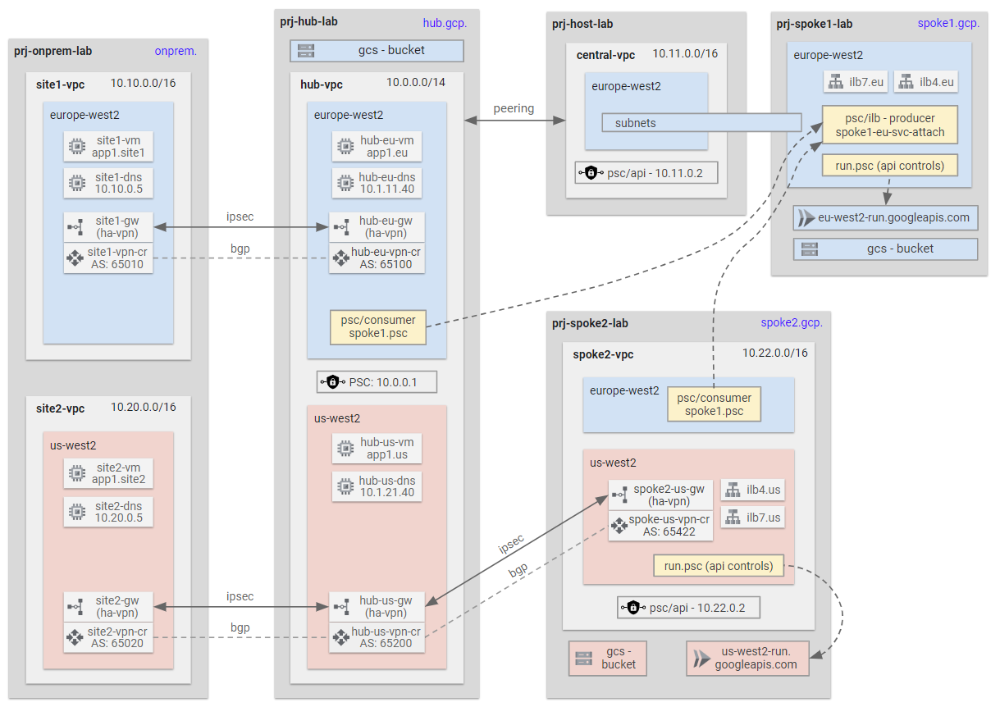

# GCP Networking Blueprints

Contents
<!-- TOC -->
- [GCP Networking Blueprints](#gcp-networking-blueprints)
  - [A. Hub and Spoke with HA VPN to On-premises](#a-hub-and-spoke-with-ha-vpn-to-on-premises)
  - [B. Hub and Spoke with Appliance IPsec Tunnel to On-premises](#b-hub-and-spoke-with-appliance-ipsec-tunnel-to-on-premises)
<!-- /TOC -->

This collection of Terraform blueprints demonstrates different hub and spoke network patterns using the latest networking products and services. It features:
* Cloud NGFW firewall policies with layer 7 inspection
* Secure tags
* Secure web proxy
* Advanced hybrid Network Connectivity Centre configurations

## A. Hub and Spoke with HA VPN to On-premises

⚙️ [**Deploy Terraform Code**](./3-labs/a-hybrid/README.md)

In this lab:

* A hub and spoke architecure with two spokes.
* All north-south and east-west traffic are allowed via VPC firewall rules.
* Hybrid connectivity to simulated on-premises sites is achieved using IPsec and BGP on Vyos network virtual appliance (NVA) routers.
* Network Connectivity Center (NCC) is used to connect the on-premises sites together via the external Hub VPC.
* Other networking features such as Cloud DNS, PSC for Google APIs and load balancers are also deployed in this lab.

## B. Hub and Spoke with Appliance IPsec Tunnel to On-premises

⚙️ [**Deploy Terraform Code**](./3-labs/b-standard/README.md)

In this lab:

* A hub and spoke architecure with two spokes.
* All north-south and east-west traffic are allowed via VPC firewall rules.
* Hybrid connectivity to simulated on-premises sites is achieved using IPsec and BGP on Vyos network virtual appliance (NVA) routers.
* Network Connectivity Center (NCC) is used to connect the on-premises sites together via the external Hub VPC.
* Other networking features such as Cloud DNS, PSC for Google APIs and load balancers are also deployed in this lab.

