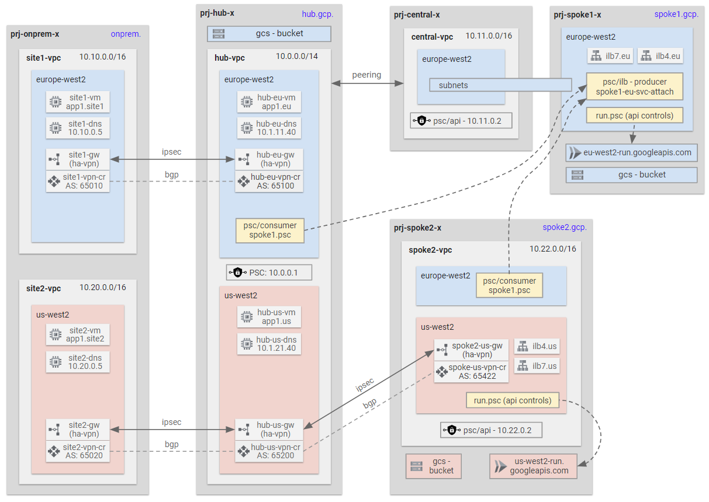

# GCP Networking Blueprints

Contents
<!-- TOC -->
- [GCP Networking Blueprints](#gcp-networking-blueprints)
  - [A. Hub and Spoke with HA VPN to On-premises](#a-hub-and-spoke-with-ha-vpn-to-on-premises)
  - [B. Hub and Spoke with Appliance IPsec Tunnel to On-premises](#b-hub-and-spoke-with-appliance-ipsec-tunnel-to-on-premises)
  - [C. Hub and Spoke with Appliance GRE Tunnel to On-premises](#c-hub-and-spoke-with-appliance-gre-tunnel-to-on-premises)
  - [D. NVA with VPC Peering to Spokes](#d-nva-with-vpc-peering-to-spokes)
  - [E. NVA with Shared VPC](#e-nva-with-shared-vpc)
  - [F. Simple Hybrid Connectivity](#f-simple-hybrid-connectivity)
<!-- /TOC -->

This collection of Terraform blueprints demonstrates different hub and spoke network patterns using the latest networking products and services. It features:
* Cloud NGFW firewall policies with layer 7 inspection
* Secure tags
* Secure web proxy
* Advanced hybrid Network Connectivity Centre configurations

## A. Hub and Spoke with HA VPN to On-premises

⚙️ [**Deploy Terraform Code**](./1-labs/a-standard/README.md)

In this lab:

* A hub and spoke architecure with two spokes.
* All north-south and east-west traffic are allowed via VPC firewall rules.
* Hybrid connectivity to simulated on-premises sites is achieved using IPsec and BGP on Vyos network virtual appliance (NVA) routers.
* Network Connectivity Center (NCC) is used to connect the on-premises sites together via the external Hub VPC.
* Other networking features such as Cloud DNS, PSC for Google APIs and load balancers are also deployed in this lab.

## B. Hub and Spoke with Appliance IPsec Tunnel to On-premises

⚙️ [**Deploy Terraform Code**](./1-labs/b-vyos-ipsec/README.md)

In this lab:

* A hub and spoke architecure with two spokes.
* All north-south and east-west traffic are allowed via VPC firewall rules.
* Hybrid connectivity to simulated on-premises sites is achieved using IPsec and BGP on Vyos network virtual appliance (NVA) routers.
* Network Connectivity Center (NCC) is used to connect the on-premises sites together via the external Hub VPC.
* Other networking features such as Cloud DNS, PSC for Google APIs and load balancers are also deployed in this lab.

## C. Hub and Spoke with Appliance GRE Tunnel to On-premises

⚙️ [**Deploy Terraform Code**](./1-labs/c-vyos-gre/README.md)

In this lab:

* A hub and spoke architecure with two spokes.
* All north-south and east-west traffic are allowed via VPC firewall rules.
* Hybrid connectivity to simulated on-premises sites is achieved using HA VPN underlay and GRE overlay with BGP routing on Vyos network virtual appliances (NVA).
* Network Connectivity Center (NCC) is used to connect the on-premises sites together via the external Hub VPC.
* Other networking features such as Cloud DNS, PSC for Google APIs and load balancers are also deployed in this lab.

## D. NVA with VPC Peering to Spokes

⚙️ [**Deploy Terraform Code**](./1-labs/d-nva-peering/README.md)

In this lab:

* A hub and spoke VPC peering architecure using network virtual appliances (NVA) to inspect traffic to spokes.
* NVA appliances are simulated using iptables on Linux instances.
* All north-south and east-west traffic are allowed via the NVA instances in this lab.
* Hybrid connectivity to simulated on-premises sites is achieved using HA VPN.
* Network Connectivity Center (NCC) is used to connect the on-premises sites together via the external Hub VPC.
* Other networking features such as Cloud DNS, PSC for Google APIs and load balancers are also deployed in this lab.

## E. NVA with Shared VPC

⚙️ [**Deploy Terraform Code**](./1-labs/e-nva-shared-vpc/README.md)

In this lab:

* A Shared VPC architecture using network virtual appliances (NVA) appliance for traffic inspection.
* NVA appliances are simulated using iptables on Linux instances.
* All north-south and east-west traffic are allowed via the NVA instances in this lab.
* Hybrid connectivity to simulated on-premises sites is achieved using HA VPN.
* [Network Connectivity Center router appliances](https://cloud.google.com/network-connectivity/docs/network-connectivity-center/concepts/ra-overview) are used to connect the on-premises sites together via the external Hub VPC.
* Other networking features such as Cloud DNS, PSC for Google APIs and load balancers are also deployed in this lab.

## F. Simple Hybrid Connectivity

⚙️ [**Deploy Terraform Code**](./1-labs/f-simple-hybrid/README.md)

In this lab:

* A hub VPC network with simple hybrid connectivity to two on-premises sites.
* All north-south and east-west traffic are allowed via VPC firewall rules.
* Hybrid connectivity to simulated on-premises sites is achieved using HA VPN.
* Network Connectivity Center (NCC) is used to connect the on-premises sites together via the external Hub VPC.
* Other networking features such as Cloud DNS, PSC for Google APIs and load balancers are also deployed in this lab.

