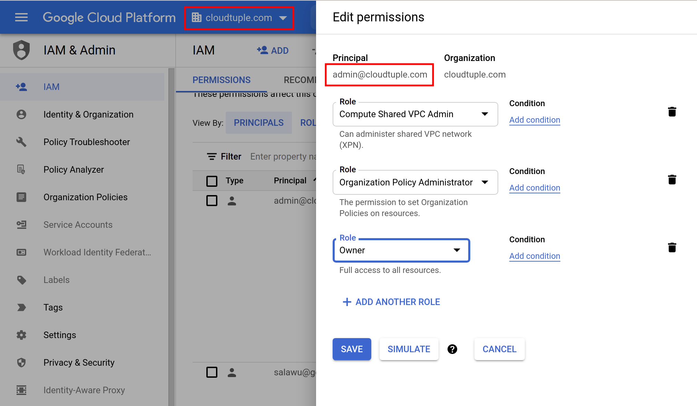
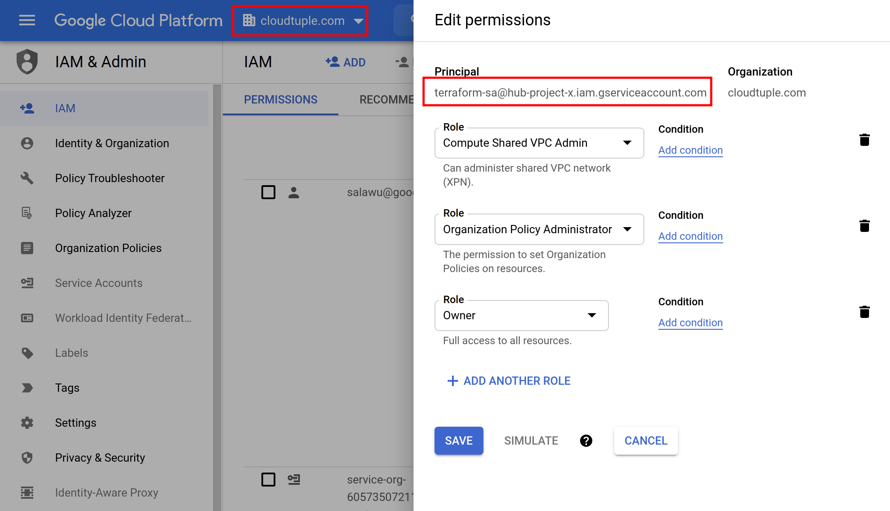

# Setup

## 1) Terraform Authentication

Some networking features in the lab require terraform to use organization-level roles and permissoins to create some resources. You need to ensure terraform has the appropriate authentication. There are 2 options.

### Option 1: gcloud authentication

Use a web flow to obtain user access credentials and place them in the well-known location for [Application Default Credentials (ADC)](https://cloud.google.com/sdk/gcloud/reference/auth/application-default/login).

```
gcloud auth application-default login
```
Terraform authenticates using the user's credentials in ADC. The user account should have the required project and organization roles. Example below shows a principal (admin@cloudtuple.com) with roles assigned at organizational level.



In some cases, terraform might be unable to create some resources (such as VPC Service Control perimeters) using ADC. For such resources, you need terraform to authenticate via service account as shown in option2.

### Option 2: service account authentication

1. Save the service account key file path, service account name and its associated project ID in environment variables
```
export PROJECT_ID=[YOUR_PROJECT_ID]
export SERVICE_ACCOUNT_NAME=[YOUR_SERVICE_ACCOUNT_NAME]
export KEY_FILE_PATH=~/tf_keys/${SERVICE_ACCOUNT_NAME}-${PROJECT_ID}.json
```

2. Create a service account and give it the required permissoins at project and/or organizational level.

```
gcloud iam service-accounts create ${SERVICE_ACCOUNT_NAME} --project ${PROJECT_ID}
```
3. Download the service account key file to a specified location. An example is shown below.

```
gcloud iam service-accounts keys create ${KEY_FILE_PATH} \
--iam-account=${SERVICE_ACCOUNT_NAME}@${PROJECT_ID}.iam.gserviceaccount.com
```

4. Provide authentication credentials to terraform (and other applications) by setting the environment variable GOOGLE_APPLICATION_CREDENTIALS.

```
export GOOGLE_APPLICATION_CREDENTIALS=${KEY_FILE_PATH}
```

At organization level, assign the following roles to the terraform service account
- Compute Shared VPC Admin
- Organization Policy Administrator
- Owner




# 2) Enable required GCP Services (Optional)

The following services and APIs need to be enabled (if not enabled already):
- compute.googleapis.com
- dns.googleapis.com
- cloudresourcemanager.googleapis.com
- iam.googleapis.com
- servicedirectory.googleapis.com
- servicenetworking.googleapis.com
- orgpolicy.googleapis.com

Save the project IDs into environment variables
```
export ONPREM_PROJECT_ID=[YOUR_ONPREM_PROJECT_ID]
export HUB_PROJECT_ID=[YOUR_HUB_PROJECT_ID]
export HOST_PROJECT_ID=[YOUR_HOST_PROJECT_ID]
export SPOKE1_PROJECT_ID=[YOUR_SPOKE1_PROJECT_ID]
export SPOKE2_PROJECT_ID=[YOUR_SPOKE2_PROJECT_ID]
```

You can use the helper script [services.sh](services.sh) to enable the services.

```
./services.sh ${ONPREM_PROJECT_ID}
./services.sh ${HUB_PROJECT_ID}
./services.sh ${HOST_PROJECT_ID}
./services.sh ${SPOKE1_PROJECT_ID}
./services.sh ${SPOKE2_PROJECT_ID}
```

# 3) Configure required organizational policies

For Argolis organizations, you need to disable enforcement for following organizational policies

- constraints/compute.restrictVpnPeerIPs
- constraints/compute.vmCanIpForward
- constraints/compute.requireOsLogin
- constraints/compute.restrictVpcPeering

See the following link for all organization policy definitions realted to `constraints/compute.restrictVpcPeering`:
https://source.corp.google.com/piper///depot/google3/configs/cloud/gong/org_hierarchy/google.com/experimental/org_policy_compute.restrictVpcPeering.yaml;rcl=326508978
